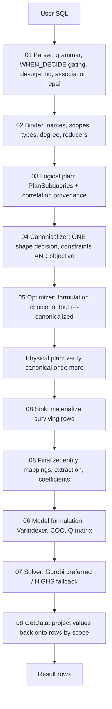

# System architecture

How DeciDB attaches to DuckDB, and the shape of the whole DECIDE path. For the
stage-by-stage detail see [`README.md`](README.md) and each stage's `done.md`;
for the file map see [`code_structure.md`](code_structure.md); for one query
walked end to end see [`trace_life_of_a_query.md`](trace_life_of_a_query.md).

---

## 1. Integration with DuckDB

DeciDB extends DuckDB's parser and planner to inject a new operator. It registers:

- **Reserved keywords** — `DECIDE`, `SUCH` (as in `SUCH THAT`), `MAXIMIZE`, `MINIMIZE`.
- **A gated token** — `WHEN_DECIDE`, which the lexer emits only inside a DECIDE
  clause, so DECIDE's postfix `WHEN` never collides with the global SQL `WHEN`.
- **Grammar productions** — `decide_clause`, `decide_declaration`, `decide_body`,
  `decide_tail`, `decide_constraint_item`, `decide_objective_item`.
- **Transformer rules** — parsed nodes into `SelectNode` fields, and the tagged
  `WHEN` / `PER` wrapper expressions.
- **A logical operator** — `LogicalDecide`, with hand-written serialization.
- **An optimizer pass** — `DecideOptimizer`.
- **A physical operator** — `PhysicalDecide`.

The design goal is to keep core DuckDB changes small and DeciDB's own code
cohesive. Standard SQL is unaffected: the DECIDE-specific token is gated, and the
grammar conflicts it introduces are keyed on that token.

---

## 2. Query lifecycle

---

## 3. Three structural decisions

### The operator sits above the scan and the filter

`LogicalDecide` is inserted above the source scan and any `Filter`, so rows
eliminated by `WHERE` never become decision variables. For most queries this is
the single most impactful thing in the whole system — each surviving row is a
solver column.

A `Projection` sits above `LogicalDecide` and prunes auxiliary variable columns,
so the user's result contains only what they declared.

### Shape is decided exactly once

Which side of a comparison each term sits on, which way the relation points, and
where a factor on a reducer lives are decided by `DecideCanonicalizer`, on the
bound tree, before the optimizer runs. Every stage below consumes that shape and
none re-decides it; a release-build verifier enforces it at three points.

That is stage 04's whole reason to exist as a stage, and
[`04_canonicalizer/done.md`](04_canonicalizer/done.md) §1 explains why a pass that
may decline can never be a single home.

### Execution is stop-and-go

`PhysicalDecide` is a pipeline breaker. The optimal value of any one decision
depends on the entire dataset, so the operator must consume all of its input
before producing a row:

1. **Sink** — buffer every tuple into a `ColumnDataCollection`.
2. **Finalize** — build entity mappings, evaluate every coefficient, `WHEN` mask
   and `PER` group against that buffer, build the solver-neutral model, solve.
3. **Source** — re-scan the buffer and append solution values.

Read consistency follows: the optimization runs on the snapshot the query saw, and
concurrent modifications cannot affect a running solve.

---

## 4. What runs where

| Concern | Owner | Not owner |
|---|---|---|
| Syntax and association | Stage 01 | Anything that moves comparison terms |
| Names, scopes, types, degree | Stage 02 | Anything that picks a formulation |
| Where terms sit | Stage 04 | Every other stage |
| Formulation (Big-M, McCormick, easy/hard) | Stage 05 | The binder, the physical operator |
| Numeric values | Stage 08 | The canonicalizer, which never evaluates |
| Backend translation | Stage 07 | Anything that inspects a SQL plan |

Solver integration stays backend-agnostic: Gurobi and HiGHS must both remain valid
implementations, and a Gurobi-only API is an accelerator with a Big-M fallback,
never a dependency.
