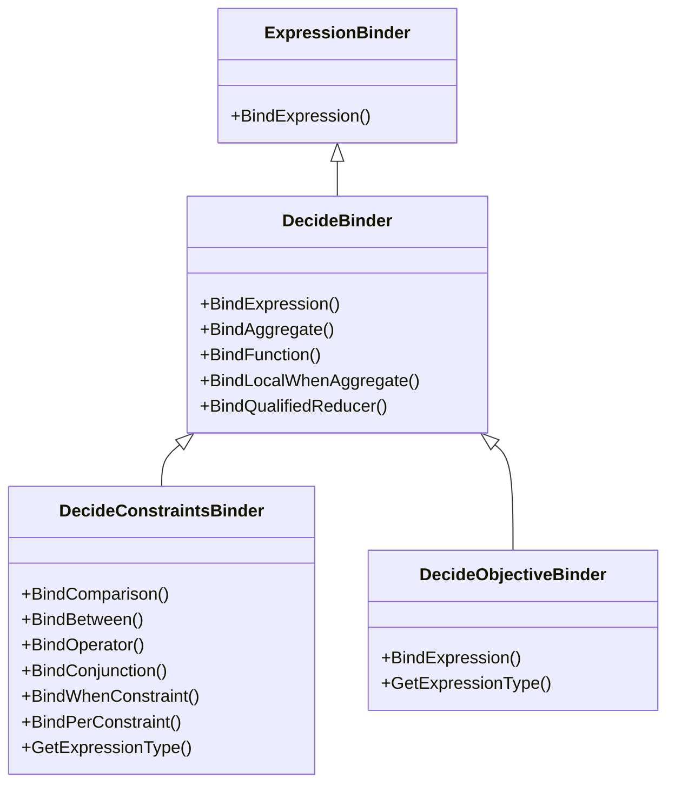
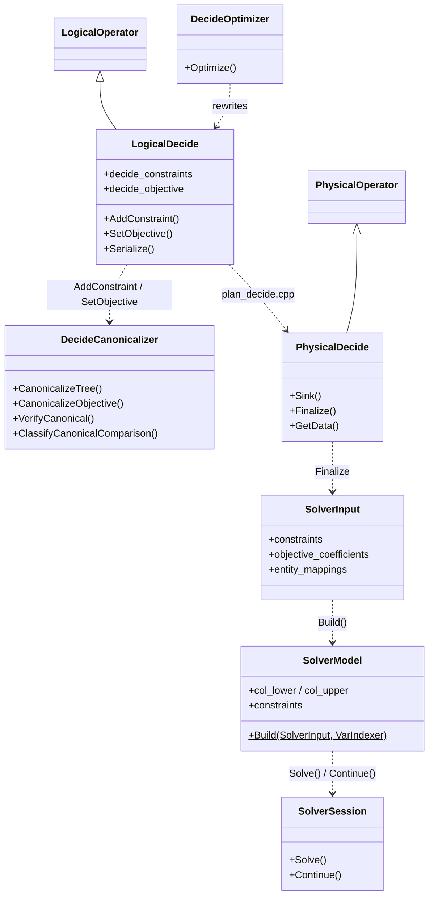

# Codebase structure

Where DeciDB lives inside the DuckDB source tree, and which stage owns each file.
Stage numbers refer to [`README.md`](README.md).

---

## 1. File organization

### Headers (`src/include/duckdb/`)

| Path | Stage | Contents |
|---|---|---|
| `common/enums/decide.hpp` | all | `DecideSense`, `DecideExpression`, `DecideVarScopeInfo`, `ConstraintKind`, every DECIDE tag constant and the tag helpers |
| `common/decide_source_info.hpp` | 03 | `ConstraintSourceInfo` — the source display registry entry |
| `decidb/parsed/decide_grammar_repair.hpp` | 01 | Association repair, `ExpressionToDot` |
| `decidb/utility/decide_parse_hints.hpp` | 01 | `MaybeAppendDecideWhenHint` |
| `planner/expression_binder/decide_binder.hpp` | 02 | Base decision binder; `ValidateSumArgument`, degree, `ValidateDecideNoExplicitDecisionCasts` |
| `planner/expression_binder/decide_constraints_binder.hpp` | 02 | `SUCH THAT` |
| `planner/expression_binder/decide_objective_binder.hpp` | 02 | `MAXIMIZE` / `MINIMIZE` |
| `planner/operator/logical_decide.hpp` | 03 | `LogicalDecide`, `EntityScopeInfo`, every metadata field |
| `planner/decide/decide_canonicalizer.hpp` | 04 | The canonical contract, in code |
| `planner/decide/decide_source_provenance.hpp` | 03 | Source capture and rendering |
| `decidb/decide_cast_policy.hpp` | 04 | `UnwrapDecideCasts`, `StripCastsForIdentity` |
| `optimizer/decide_optimizer.hpp` | 05 | The rewrite passes |
| `execution/operator/decide/physical_decide.hpp` | 08 | `PhysicalDecide`, `Term`, `DecideConstraint`, `Objective` |
| `decidb/solver_input.hpp` | 06/08 | `SolverInput`, `EvaluatedConstraint`, `CoefficientColumn`, `EntityMapping` |
| `decidb/ilp_model.hpp` | 06 | `VarIndexer`, `SolverModel`, `ModelConstraint`, `ConstraintProvenance`, `SparseCoeffAccumulator` |
| `decidb/ilp_solver.hpp` | 07 | `SolveModel` facade, `SolverBackend`, `SolveModelOptions` |
| `decidb/solver_result.hpp` | 07 | `SolverStatus`, `SolverResult`, `ThrowDecideSolveError` |
| `decidb/solver_session.hpp` | 07 | `SolverSession` — warm continuation |
| `decidb/solver_config.hpp` | 07 | Time limits, primary and diagnostic |
| `decidb/gurobi/gurobi_solver.hpp`, `gurobi_loader.hpp` | 07 | Gurobi backend and dynamic loading |
| `decidb/decide_diagnostic.hpp`, `decide_diagnostic_engines.hpp`, `decide_router.hpp` | — | Query diagnostics; see `../07_query_diagnostics/` |

### Sources (`src/`)

| Path | Stage | Lines | Contents |
|---|---|---|---|
| `decidb/parsed/decide_grammar_repair.cpp` | 01 | ~340 | Three association repairs, `ExpressionToDot` |
| `decidb/utility/decide_parse_hints.cpp` | 01 | ~65 | DECIDE-aware parse-error hint |
| `planner/expression_binder/decide_binder.cpp` | 02 | ~1,020 | Shared DECIDE expression rules, degree, reducers, qualified reducers |
| `planner/expression_binder/decide_constraints_binder.cpp` | 02 | ~550 | `SUCH THAT` |
| `planner/expression_binder/decide_objective_binder.cpp` | 02 | ~240 | Objective |
| `planner/binder/query_node/bind_select_node.cpp` | 01/02 | — | Declarations, scopes, and the parsed-tree rewrites (see stage 01 `todo.md`) |
| `planner/binder/query_node/plan_select_node.cpp` | 03/04 | ~290 | Subquery flattening, correlation provenance, the user canonicalization call |
| `planner/operator/logical_decide.cpp` | 03 | ~415 | `AddConstraint`, `SetObjective`, EXPLAIN strings, serialization |
| `planner/decide/decide_canonicalizer.cpp` | 04 | ~985 | The one shape boundary |
| `planner/decide/decide_source_provenance.cpp` | 03 | ~250 | Source display capture and rendering |
| `decidb/utility/decide_cast_policy.cpp` | 04 | ~60 | Cast unwrapping |
| `optimizer/decide/decide_optimizer.cpp` | 05 | ~1,740 | All eight rewrite passes |
| `execution/column_binding_resolver.cpp` | 03 | — | The `LOGICAL_DECIDE` case, with `ignored_bindings` |
| `execution/physical_plan/plan_decide.cpp` | 03/08 | ~170 | Logical → physical, entity key indices, verification |
| `execution/operator/decide/physical_decide.cpp` | 08 | ~7,400 | Extraction, materialization, evaluation, emission, readback |
| `decidb/utility/ilp_model_builder.cpp` | 06 | ~1,400 | `SolverModel::Build` |
| `decidb/utility/ilp_solver.cpp` | 07 | ~395 | Dispatch, INF_OR_UNBD probe, ray attachment |
| `decidb/gurobi/gurobi_solver.cpp`, `gurobi_loader.cpp` | 07 | ~830 | Gurobi backend |
| `decidb/naive/deterministic_naive.cpp` | 07 | — | HiGHS backend |
| `decidb/utility/decide_diagnostic*.cpp`, `decide_router.cpp` | — | ~2,100 | Diagnostics |

### Grammar (`third_party/libpg_query/`)

| Path | Contents |
|---|---|
| `grammar/statements/select.y` | Every DECIDE production |
| `grammar/grammar.y` | The `%expect 9` conflict budget and its rationale |
| `grammar/keywords/reserved_keywords.list` | `DECIDE`, `MAXIMIZE`, `MINIMIZE`, `SUCH` |
| `src_backend_parser_parser.cpp` | `base_yylex` — the `WHEN_DECIDE` gating |

---

## 2. Class hierarchy

### Binders

`ValidateSumArgument()`, `ValidateDecideNoNonLinearScalar()` and
`ValidateDecideNoExplicitDecisionCasts()` are free functions declared in
`decide_binder.hpp`, not methods.

### Operators and the model path

---

## 3. Key entry points

### `src/decidb/parsed/decide_grammar_repair.cpp` — stage 01
- **`RepairDecideConstraintGrammar()`** — reassociates `A AND B WHEN c` and
  `A AND B PER col`. Comparisons are copied through untouched.
- **`RepairDecideObjectiveGrammar()`** — reassociates `SUM(x) WHEN a > b`.
- **`ExpressionToDot()`** — Graphviz dump of a parsed expression. No live callers.

### `src/planner/expression_binder/decide_binder.cpp` — stage 02
- **`ValidateSumArgument()`** — linear (or optionally quadratic) combination check.
- **`DecideDegreeInternal()`** — polynomial degree, not occurrence count.
- **`ValidateDecideNoExplicitDecisionCasts()`** — the cast authorship boundary.
- **`BindLocalWhenAggregate()` / `BindQualifiedReducer()`**.

### `src/planner/decide/decide_canonicalizer.cpp` — stage 04
- **`CanonicalizeTree()` / `CanonicalizeComparison()` / `CanonicalizeObjective()`** — pure.
- **`Decompose()` / `PeelScale()` / `BuildAdditive()`** — shared by both clauses.
- **`ClassifyCanonicalComparison()`** — `PER_ROW` / `AGGREGATE` / `INVALID`.
- **`VerifyCanonical()` / `VerifyCanonicalObjective()`** — non-mutating, throwing.

### `src/planner/operator/logical_decide.cpp` — stage 03
- **`AddConstraint()` / `SetObjective()`** — the only post-planning entry points.
- **`CollectDecideExpressionStrings()`** — the EXPLAIN walker, shared with the
  physical operator.
- **`Serialize()` / `Deserialize()`** — hand-maintained.

### `src/optimizer/decide/decide_optimizer.cpp` — stage 05
- **`OptimizeDecide()`** — the eight-pass sequence.

### `src/execution/operator/decide/physical_decide.cpp` — stage 08
- **`GetGlobalSinkState()`** — constructs the sink state, which absorbs bounds and
  extracts terms before any data arrives.
- **`Sink()` / `Combine()`** — materialize into a `ColumnDataCollection`.
- **`Finalize()`** — entity mappings, coefficient evaluation, model build, solve.
- **`GetData()`** — readback with type-specific projection.

### `src/decidb/utility/ilp_model_builder.cpp` — stage 06
- **`SolverModel::Build(SolverInput &, const VarIndexer &)`** — three linear
  constraint paths plus the quadratic builder. Takes `SolverInput` by non-const
  reference so raw global constraints can be moved.
- **`SparseCoeffAccumulator`** — reusable scratch, dense or sorted-pairs.

### `src/decidb/utility/ilp_solver.cpp` — stage 07
- **`SelectSolverBackend()` / `SolveModel()` / `CreateSolverSession()`**.

---

## 4. Table-scoped variables end to end

| Struct | Where | What |
|---|---|---|
| `EntityScopeInfo` | `logical_decide.hpp` | `table_alias`, `source_table_index`, `entity_key_bindings`, `entity_key_physical_indices`, `scoped_variable_indices` |
| `EntityMapping` | `solver_input.hpp` | `num_entities`, `row_to_entity` — built at execution |
| `VarIndexer` | `ilp_model.hpp` | The four-block layout and `Get` / `InstanceColumn` / `NumInstances` |

The path:

1. **Grammar** — `ColId '.' ColId '(' variable_type ')'` in `select.y`.
2. **Binder** — resolves the alias, creates or reuses the scope via
   `FindOrCreateEntityScope`, records `DecideVarScopeInfo::Entity(idx)`.
3. **Logical plan** — `entity_key_expressions` keeps the key columns alive through
   column pruning.
4. **Plan creation** — `plan_decide.cpp` resolves logical bindings to physical
   chunk indices against the child's `GetColumnBindings()`.
5. **Optimizer** — auxiliary variables are global, not entity-scoped.
6. **Execution PHASE 1.5** — composite NULL-safe key → entity id → `row_to_entity`.
7. **Model building** — one solver column per entity; coefficients from rows sharing
   an entity **accumulate** through `SparseCoeffAccumulator`.
8. **Readback** — `var_indexer.Get(var_idx, row)`, so every row of an entity gets the
   same value.
