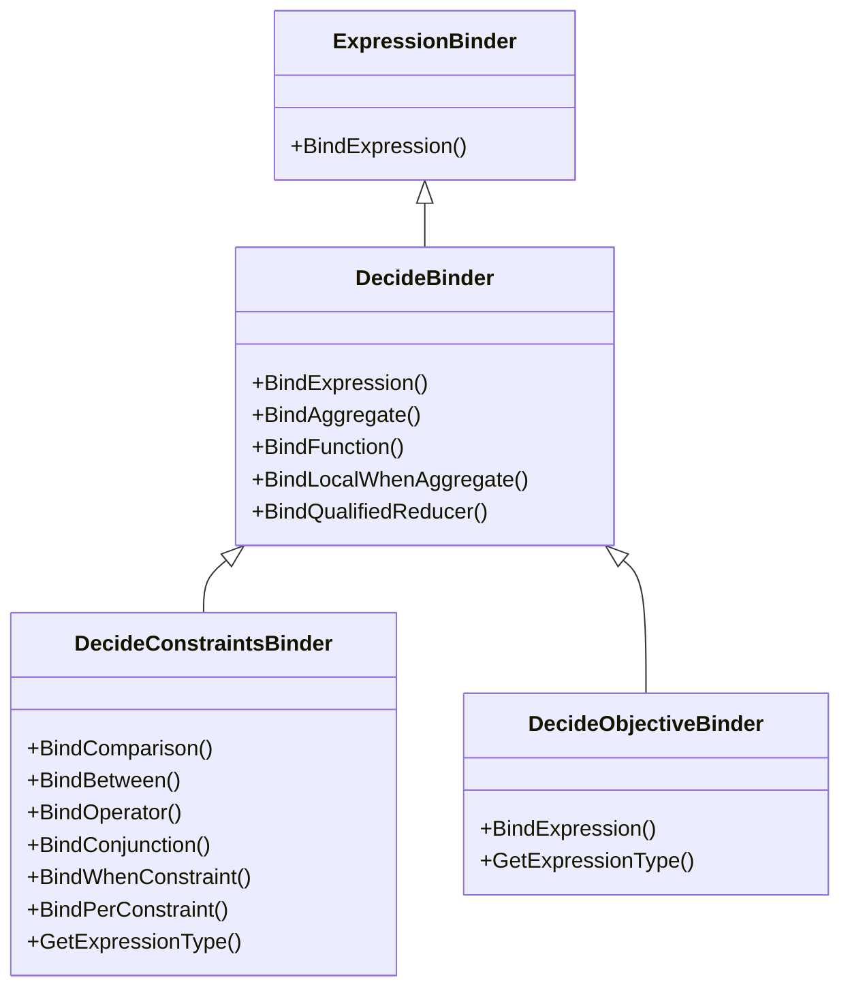
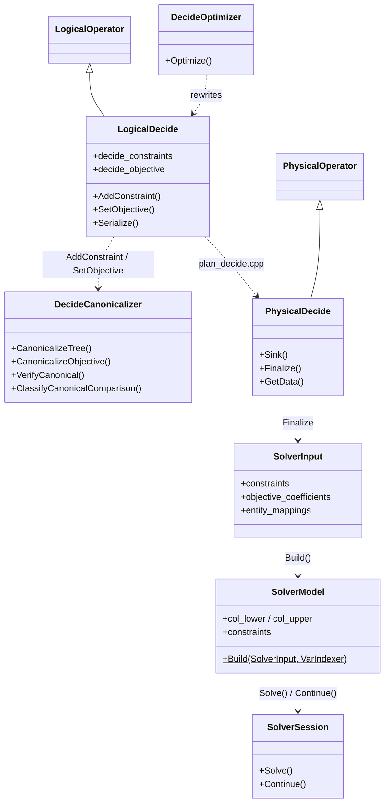

# Codebase structure

Where DeciDB lives inside the DuckDB source tree, and which stage owns each file.
Stage numbers refer to [`README.md`](README.md).

---

## 1. File organization

### Headers (`src/include/duckdb/`)

| Path | Stage | Contents |
|---|---|---|
| `common/enums/decide.hpp` | all | `DecideSense`, `DecideExpression`, `DecideVarScopeInfo`, `ConstraintKind`, every DECIDE tag constant and the tag helpers |
| `common/decide_source_info.hpp` | 03 | `ConstraintSourceInfo` — the source display registry entry |
| `common/decide_solver_capabilities.hpp` | 07 answers, 03/05/06/08 read | `SolverCapabilities`, `SolverConstructSupport`, `SolverModelClass` — the backend differences upstream stages branch on. In `common/` because stage 07 answers it but four stages above read it |
| `parser/decide/decide_parse_hints.hpp` | 01 | `MaybeAppendDecideWhenHint` |
| `planner/expression_binder/decide/decide_binder.hpp` | 02 | Base decision binder; `ValidateSumArgument`, degree, `ValidateDecideNoExplicitDecisionCasts` |
| `planner/expression_binder/decide/decide_constraints_binder.hpp` | 02 | `SUCH THAT` |
| `planner/expression_binder/decide/decide_objective_binder.hpp` | 02 | `MAXIMIZE` / `MINIMIZE` |
| `planner/expression_binder/decide/decide_declarations_binder.hpp` | 02 | `DecideDeclarationsBinder` — the whole DECIDE clause: declarations, scopes, then `SUCH THAT` and the objective |
| `planner/expression_binder/decide/decide_degree.hpp` | 02 | `DecideDegree`, `DecideExpressionDegree` — the one definition of polynomial degree, and which degree-2 shape produced it |
| `planner/operator/decide/logical_decide.hpp` | 03 | `LogicalDecide`, `EntityScopeInfo`, every metadata field |
| `planner/operator/decide/logical_decide_diagnose.hpp` | 03 | `LogicalDecideDiagnose` — the `DIAGNOSE <select>` plan node and the shape of the relation it returns |
| `planner/decide/decide_canonicalizer.hpp` | 04 | The canonical contract, in code |
| `planner/decide/decide_constraint_walk.hpp` | 04 | Which children of a node are constraints: the WHEN/PER wrapper predicates and the constraint-position walk every stage shares |
| `planner/decide/decide_source_provenance.hpp` | 03 | Source capture and rendering |
| `planner/decide/decide_cast_policy.hpp` | 04 | `UnwrapDecideCasts`, `StripCastsForIdentity`, `GetBareDecideColumnRef` |
| `planner/decide/decide_prepared_model.hpp` | 05/08 | The prepared linear form — stage 05's flattened terms, stage 08's coefficients |
| `optimizer/decide/decide_optimizer.hpp` | 05 | The rewrite passes |
| `optimizer/decide/decide_linear_form.hpp` | 05 | Flattening into `decide.prepared`; the last DECIDE optimization pass |
| `optimizer/decide/decide_solver_gate.hpp` | 05 | Backend choice, the native-construct mask, and the plan-time model-class gate |
| `optimizer/decide/decide_optimizer_internal.hpp` | 05 | Helpers shared by the `decide_rewrite_*.cpp` passes; internal to `src/optimizer/decide/` |
| `execution/operator/decide/physical_decide.hpp` | 08 | `PhysicalDecide`, `Term`, `DecideConstraint`, `Objective` |
| `decidb/formulation/solver_input.hpp` | 06/08 | `SolverInput`, `EvaluatedConstraint`, `CoefficientColumn`, `EntityMapping` |
| `decidb/formulation/ilp_model.hpp` | 06 | `VarIndexer`, `SolverModel`, `ModelConstraint`, `ConstraintProvenance`, `SparseCoeffAccumulator` |
| `decidb/formulation/ilp_linearization.hpp` | 06 | `LowerDecideConstructs` and the Big-M derivations: a tagged constraint becomes solver rows |
| `decidb/formulation/ilp_linearization_internal.hpp` | 06 | Helpers shared by the `linearization_*.cpp` passes; internal to `src/decidb/formulation/` |
| `decidb/solver/ilp_solver.hpp` | 07 | `SolveModel` facade, `SolverBackend`, `SolveModelOptions` |
| `decidb/solver/solver_result.hpp` | 07 | `SolverStatus`, `SolverResult`, `ThrowDecideSolveError` |
| `decidb/solver/solver_session.hpp` | 07 | `SolverSession` — warm continuation |
| `decidb/solver/solver_config.hpp` | 07 | Time limits, primary and diagnostic |
| `decidb/solver/solver_registry.hpp` | 07 | `SolverBackend` handle, `SolverRegistry` — the one place a backend is named |
| `decidb/solver/probe_models.hpp` | 07 | Zero-objective and ray-fallback probe models for diagnostic re-solves |
| `decidb/gurobi/gurobi_solver.hpp`, `gurobi_loader.hpp` | 07 | Gurobi backend and dynamic loading |
| `decidb/naive/deterministic_naive.hpp` | 07 | HiGHS backend — vendored, statically linked, the capability floor |
| `decidb/diagnostics/decide_diagnostic.hpp`, `decide_diagnostic_engines.hpp`, `decide_diagnostic_render.hpp`, `decide_router.hpp`, `diagnostic_constants.hpp` | — | Query diagnostics; see `../07_query_diagnostics/` |

### Sources (`src/`)

| Path | Stage | Contents |
|---|---|---|
| `parser/decide/decide_parse_hints.cpp` | 01 | DECIDE-aware parse-error hint |
| `planner/expression_binder/decide/decide_binder.cpp` | 02 | Shared DECIDE expression rules, degree, reducers, qualified reducers |
| `planner/expression_binder/decide/decide_constraints_binder.cpp` | 02 | `SUCH THAT` |
| `planner/expression_binder/decide/decide_objective_binder.cpp` | 02 | Objective |
| `planner/expression_binder/decide/decide_declarations_binder.cpp` | 02 | DECIDE declarations, scopes, scoped-variable spelling, and the `SUCH THAT` / objective binds |
| `planner/expression_binder/decide/decide_degree.cpp` | 02 | The degree walk, `DecideExpressionDegree`, and the constraint-degree validator |
| `planner/binder/query_node/bind_select_node.cpp` | 02 | Generic SELECT binding. Its DECIDE branch is one `DecideDeclarationsBinder::BindDeclarations()` call |
| `planner/binder/query_node/plan_select_node.cpp` | 03/04 | Subquery flattening, correlation provenance, the user canonicalization call |
| `planner/operator/decide/logical_decide.cpp` | 03 | `AddConstraint`, `SetObjective`, EXPLAIN strings, serialization |
| `planner/operator/decide/logical_decide_diagnose.cpp` | 03 | The DIAGNOSE node: EXPLAIN strings and serialization |
| `planner/decide/decide_canonicalizer.cpp` | 04 | The one shape boundary |
| `planner/decide/decide_source_provenance.cpp` | 03 | Source display capture and rendering |
| `planner/decide/decide_cast_policy.cpp` | 04 | Cast unwrapping |
| `optimizer/decide/decide_optimizer.cpp` | 05 | The eight-pass dispatcher and the helpers the passes share |
| `optimizer/decide/decide_rewrite_norm_in.cpp` | 05 | `norm` and DECIDE-variable `IN` |
| `optimizer/decide/decide_rewrite_notequal_avg.cpp` | 05 | `<>` indicators and AVG→SUM |
| `optimizer/decide/decide_rewrite_abs.cpp` | 05 | ABS Big-M tagging and linearization |
| `optimizer/decide/decide_rewrite_minmax.cpp` | 05 | MIN/MAX, plain and composed |
| `optimizer/decide/decide_rewrite_bilinear.cpp` | 05 | Bilinear McCormick |
| `optimizer/decide/decide_bound_absorption.cpp` | 05 | Literal bounds folded into column boxes |
| `optimizer/decide/decide_linear_form.cpp` | 05 | Flattens every constraint and the objective into `decide.prepared`; must run last |
| `optimizer/decide/decide_solver_gate.cpp` | 05 | `ChooseDecideSolver`, `DeriveDecideModelClass`, `RequireDecideSolverSupport` |
| `execution/column_binding_resolver.cpp` | 03 | The `LOGICAL_DECIDE` case, with `ignored_bindings` |
| `execution/physical_plan/plan_decide.cpp` | 03/08 | Logical → physical, entity key indices, verification |
| `execution/operator/decide/physical_decide.cpp` | 08 | Extraction, materialization, evaluation, emission, readback |
| `decidb/formulation/ilp_model_builder.cpp` | 06 | `SolverModel::Build` |
| `decidb/formulation/ilp_linearization.cpp` | 06 | `LowerDecideConstructs`, global-auxiliary allocation |
| `decidb/formulation/linearization_bigm.cpp` | 06 | Big-M sizing and the per-row range walks |
| `decidb/formulation/linearization_minmax.cpp` | 06 | MIN/MAX: constraints, links, objectives, composed |
| `decidb/formulation/linearization_not_equal.cpp` | 06 | `<>` collapse and Big-M disjunction |
| `decidb/formulation/linearization_bilinear_abs.cpp` | 06 | McCormick and ABS rows |
| `decidb/solver/ilp_solver.cpp` | 07 | Dispatch, INF_OR_UNBD probe, ray attachment |
| `decidb/solver/solver_registry.cpp` | 07 | `REGISTERED_BACKENDS` — the one table naming every backend |
| `decidb/solver/probe_models.cpp` | 07 | Probe models for the diagnostic re-solve and ray-extraction paths |
| `decidb/gurobi/gurobi_solver.cpp`, `gurobi_loader.cpp` | 07 | Gurobi backend |
| `decidb/naive/deterministic_naive.cpp` | 07 | HiGHS backend |
| `decidb/diagnostics/decide_diagnostic*.cpp`, `decide_router.cpp` | — | Diagnostics |

### Grammar (`third_party/libpg_query/`)

| Path | Contents |
|---|---|
| `grammar/statements/select.y` | Every DECIDE production |
| `grammar/grammar.y` | The `%expect 6` conflict budget and its rationale |
| `grammar/keywords/reserved_keywords.list` | `DECIDE`, `MAXIMIZE`, `MINIMIZE`, `SUCH` |
| `src_backend_parser_parser.cpp` | `base_yylex` — the `WHEN_DECIDE` gating |

---

## 2. Class hierarchy

### Binders

`ValidateSumArgument()`, `ValidateDecideNoNonLinearScalar()` and
`ValidateDecideNoExplicitDecisionCasts()` are free functions declared in
`decide_binder.hpp`, not methods.

### Operators and the model path

---

## 3. Key entry points

### `src/planner/expression_binder/decide/decide_binder.cpp` — stage 02
- **`ValidateSumArgument()`** — linear (or optionally quadratic) combination check.
- **`DecideDegreeInternal()`** — polynomial degree, not occurrence count.
- **`ValidateDecideNoExplicitDecisionCasts()`** — the cast authorship boundary.
- **`BindLocalWhenAggregate()` / `BindQualifiedReducer()`**.

### `src/planner/decide/decide_canonicalizer.cpp` — stage 04
- **`CanonicalizeTree()` / `CanonicalizeComparison()` / `CanonicalizeObjective()`** — pure.
- **`Decompose()` / `PeelScale()` / `BuildAdditive()`** — shared by both clauses.
- **`ClassifyCanonicalComparison()`** — `PER_ROW` / `AGGREGATE` / `INVALID`.
- **`VerifyCanonical()` / `VerifyCanonicalObjective()`** — non-mutating, throwing.

### `src/include/duckdb/planner/decide/decide_constraint_walk.hpp` — stage 04
Header-only, and the one place that answers "which children of this node are
constraints". A bound constraint tree is AND-conjunctions plus WHEN/PER wrappers,
and a wrapper's trailing children are metadata — the WHEN condition, the PER
grouping columns — so descending into them would read `WHEN c` as another
constraint.
- **`IsWhenConstraintWrapper()` / `IsPerConstraintWrapper()` / `IsConstraintWrapper()`
  / `IsConstraintChild()`** — the predicates. Every site that walks a bound
  constraint tree asks these, including the few that deliberately act differently
  on the answer: bound absorption refuses to descend into a WHEN, and the MIN/MAX
  rewrite strips a PER as it goes. They bring their own descent, not their own
  definition of a wrapper, so a new wrapper kind is a one-line change here.
- **`VisitConstraintTree()`** — parents before children, skipping metadata, with a
  visitor that can stop the walk. Const and mutating overloads. Neither hands out
  the owning `unique_ptr`: a pass that reseats a node is deciding tree shape and
  belongs at stage 04's boundary, not inside a traversal.
- **`ForEachConstraintLeaf()`** — one call per model row (a comparison, a bound
  `IN`, a bare boolean decision, a placeholder from an earlier rewrite). The shape
  most consumers want.

### `src/planner/operator/decide/logical_decide.cpp` — stage 03
- **`AddConstraint()` / `SetObjective()`** — the only post-planning entry points.
- **`Serialize()` / `Deserialize()`** — hand-maintained.

### `src/planner/decide/decide_source_provenance.cpp` — stage 03
- **`TagDecideSourceFragments()`** — records each cast/subquery's written spelling
  before binding obscures it.
- **`RenderDecideSource()`** — the one user-facing expression renderer, used by
  both EXPLAIN paths and by the diagnosis labels.
- **`CollectDecideExpressionStrings()`** — the EXPLAIN walker, shared by the
  logical and physical operators.
- **`InitializeConstraintSourceInfo()` / `FinalizeConstraintSourceInfo()`** — the
  per-clause display registry, indexed by `source_clause_id`.

### `src/optimizer/decide/decide_optimizer.cpp` — stage 05
- **`OptimizeDecide()`** — the eight-pass sequence. Each pass body lives in a
  `decide_rewrite_*.cpp` sibling (or `decide_bound_absorption.cpp`); this file keeps
  the dispatcher, `AppendConstraint`, and the helpers the passes share, declared in
  `decide_optimizer_internal.hpp`.

### `src/execution/operator/decide/physical_decide.cpp` — stage 08
- **`GetGlobalSinkState()`** — constructs the sink state, which absorbs bounds and
  extracts terms before any data arrives.
- **`Sink()` / `Combine()`** — materialize into a `ColumnDataCollection`.
- **`Finalize()`** — entity mappings, coefficient evaluation, model build, solve.
- **`GetData()`** — readback with type-specific projection.

### `src/decidb/formulation/ilp_model_builder.cpp` — stage 06
- **`SolverModel::Build(SolverInput &, const VarIndexer &)`** — three linear
  constraint paths plus the quadratic builder, then the two native lists
  (general and indicator constraints) carried across in flat columns. Takes
  `SolverInput` by non-const reference so raw global constraints can be moved.
- **`SolverModel::ModelClass()`** — what the built model demands of a solver; the
  fact stage 05's plan-time prediction is checked against.
- **`SparseCoeffAccumulator`** — reusable scratch, dense or sorted-pairs.

### `src/decidb/solver/ilp_solver.cpp` — stage 07
- **`SelectSolverBackend()` / `SolveModel()`**. `SolveModel` takes the backend chosen
  at plan time rather than resolving one, and asserts the built model is within that
  backend's declared capabilities before loading it.

### `src/decidb/solver/solver_registry.cpp` — stage 07
- **`REGISTERED_BACKENDS`** — the one table naming every backend: identifier, display
  name, availability probe, capabilities, session factory. Adding a backend is adding a
  row; nothing else in the tree branches on which one is in play.
- **`SolverBackend`** — the handle the pipeline passes around, and
  **`SolverRegistry::Find` / `Backends` / `BackendsSupporting`**.

### `src/optimizer/decide/decide_solver_gate.cpp` — stage 05
- **`DeriveDecideModelClass()` / `RequireDecideSolverSupport()`** — the plan-time
  model-class gate. Refuses, before a row is read, a query whose model class the chosen
  backend cannot take.

---

## 4. Table-scoped variables end to end

| Struct | Where | What |
|---|---|---|
| `EntityScopeInfo` | `logical_decide.hpp` | `table_alias`, `source_table_index`, `entity_key_bindings`, `entity_key_physical_indices`, `scoped_variable_indices` |
| `EntityMapping` | `solver_input.hpp` | `num_entities`, `row_to_entity` — built at execution |
| `VarIndexer` | `ilp_model.hpp` | The four-block layout and `Get` / `InstanceColumn` / `NumInstances` |

The path:

1. **Grammar** — `ColId '.' ColId '(' variable_type ')'` in `select.y`.
2. **Binder** — resolves the alias, creates or reuses the scope via
   `FindOrCreateEntityScope`, records `DecideVarScopeInfo::Entity(idx)`.
3. **Logical plan** — `entity_key_expressions` keeps the key columns alive through
   column pruning.
4. **Plan creation** — `plan_decide.cpp` resolves logical bindings to physical
   chunk indices against the child's `GetColumnBindings()`.
5. **Optimizer** — auxiliary variables are global, not entity-scoped.
6. **Execution PHASE 1.5** — composite NULL-safe key → entity id → `row_to_entity`.
7. **Model building** — one solver column per entity; coefficients from rows sharing
   an entity **accumulate** through `SparseCoeffAccumulator`.
8. **Readback** — `var_indexer.Get(var_idx, row)`, so every row of an entity gets the
   same value.
