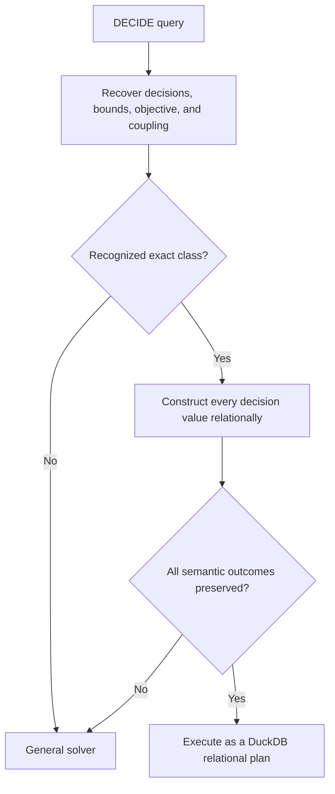

# Direct Solve Overview

## The idea

A DECIDE query declares variables, constraints, and an objective. DeciDB currently
turns that problem into a general solver model even when its structure already implies
a direct solution.

Direct solve asks a different question:

> Can an ordinary DuckDB relational plan construct an optimal assignment for this
> problem shape?

If the answer is provably yes, the optimizer can replace the DECIDE solve with
projections, aggregates, ranks, windows, joins, and other existing DuckDB operators.
If the proof is incomplete, the query stays on the existing solver path.



This is not a SQL-text substitution. Recognition is based on the normalized meaning of
the optimization problem, so algebraically equivalent queries can use the same rule.
The SQL in each rule card shows the core assignment construction rather than a
standalone replacement query. Its **Valid when** section also requires the surrounding
guards that preserve infeasible, empty, NULL, identity, and numeric outcomes.

## Three motivating translations

### 1. Independent nearest targets

Each row chooses an amount near its target, within a legal interval.

```sql
SELECT id, amount
FROM items
DECIDE amount(REAL)
SUCH THAT amount BETWEEN 0 AND capacity
MINIMIZE SUM(POWER(amount - target, 2));
```

Every decision is independent. The direct assignment is its target projected into the
interval:

```sql
SELECT id,
       LEAST(capacity, GREATEST(0.0, target)) AS amount
FROM items;
```

No solver is needed because a one-dimensional squared loss is minimized at the target
or the closest legal endpoint. This is the simplest form of **A1**.

### 2. Choose the best `k` per group

Each department selects two candidates.

```sql
SELECT id, department, selected
FROM candidates
DECIDE selected(BOOL)
SUCH THAT SUM(selected) = 2 PER department
MAXIMIZE SUM(score * selected);
```

The direct plan ranks candidates inside each department:

```sql
SELECT id, department, (rank <= 2)::INTEGER AS selected
FROM (
    SELECT *,
           ROW_NUMBER() OVER (
               PARTITION BY department
               ORDER BY score DESC, id
           ) AS rank
    FROM candidates
);
```

This is the ranking core. The complete S1 plan first checks that every instantiated,
non-NULL department has at least two eligible decisions and reports `INFEASIBLE` when
the equality cannot be met; NULL `PER` keys bypass the department factor.

If a lower-scoring selected candidate can be exchanged for a higher-scoring unselected
candidate, the objective improves without changing the count. Therefore the top two
are optimal. This is **S1**.

### 3. Allocate one divisible budget

Materials consume different amounts of budget and provide different value per unit.

```sql
SELECT id, amount
FROM materials
DECIDE amount(REAL)
SUCH THAT amount <= available
      AND SUM(unit_cost * amount) <= 1000
MAXIMIZE SUM(unit_value * amount);
```

The direct algorithm orders material by value per unit of budget, fills the best
material to capacity, and partially fills at most one final material. SQL expresses
that construction with an ordered prefix sum.

This works because the decisions are divisible. Replacing `REAL` amounts with Boolean
choices creates an indivisible knapsack problem and invalidates the partial-fill proof.
This is the linear case of **R1**.

## What exact means

A direct translation is exact when it preserves the optimization problem's observable
result:

- the assignment is feasible;
- the primary objective is optimal;
- every decision value maps back to the correct source rows;
- output types and cardinality are preserved; and
- infeasible, unbounded, invalid, and empty-input outcomes keep their DECIDE meaning.

Two optimal assignments may differ when the optimum is tied. A stable SQL tie-breaker
is useful for reproducibility, but matching the solver's exact decision vector is not a
correctness requirement.

## What must be proved

Each translation has its own conditions, but every direct rewrite depends on the same
basic discipline:

1. Identify the actual row, entity, or scalar decision instances.
2. Collect their effective objective and constraint coefficients.
3. Prove the required domains, bounds, signs, groups, and interactions.
4. Construct every decision value, not only the optimal objective value.
5. Preserve errors and edge cases covered by the admitted class.

Each card puts its complete class-specific checklist in **Valid when**. Its proof then
has two separate obligations: show that the construction is feasible, and show that no
other feasible assignment has a better primary objective.

Eligibility must follow from exact query and catalog facts. Estimated cardinality,
sampled distinct counts, or properties that happen to hold in the current data may
help choose between two correct plans, but they cannot prove that a rewrite is valid.

## How the catalogue is organized

The most useful classification is how decisions interact:

| Interaction shape | Translation family |
|---|---|
| Decisions are independent or form one fixed-small component | [Formula-based translations](02_formula_based_translations.md) |
| Many rows share one value, affine expression, or geometric constraint | [Formula-based translations](02_formula_based_translations.md) |
| Boolean decisions share structured count or budget constraints | [Selection translations](03_selection_translations.md) |
| Numeric decisions draw from one shared resource | [Resource allocation](04_resource_allocation.md) |
| Two complete ordered sides must be matched | [Ordered matching and transport](05_ordered_matching_and_transport.md) |
| A larger model separates into independent supported components | [Composition and boundaries](06_composition_and_boundaries.md) |

The rule IDs are stable names, not the recommended reading order.

## Current status

The catalogue contains:

- **15 exact translations** with feasibility and optimality proofs under their complete
  `Valid when` contracts;
- **4 exact prototypes** with the same mathematical proofs but admission, numeric, or
  complete-plan performance gates that are not yet implementable;
- additional research candidates; and
- explicit problem families that should remain with the solver.

No direct-rewrite optimizer feature has been implemented yet. The catalogue says what
is possible under stated conditions; it is not a claim that current DeciDB already
selects these plans.
