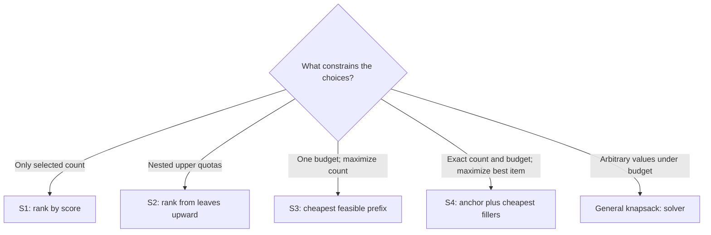

# Boolean Selection Translations

These translations construct optimal yes/no choices using ranking and prefix
operations. They are separate classes even when their SQL uses similar windows: each
class relies on a different proof.



| Rule | Objective | Coupling | Direct idea |
|---|---|---|---|
| S1 | Additive score | One count interval per independent group | Best legal score prefix |
| S2 | Additive score | Nested upper quotas | Repeated TopN from leaves to root |
| S3 | Selected count | One additive budget | Largest feasible cheapest prefix |
| S4 | Best selected reward | Exact count and one budget | Best feasible anchor plus fillers |

The SQL below is the assignment-producing core of a generated plan. `decision_rows`
has one row per free planner-owned identity after coefficient collection;
`fixed_assignments` stores any choices removed during normalization; and `source_rows`
maps both back to the original rows. The named `*_factor_state` relations retain
effective parameters and fixed contributions even when a factor has no free decision.
An outcome gate is evaluated before any fixed or free assignment is returned:
`INFEASIBLE` becomes the corresponding DECIDE outcome, while an empty child creates no
factor.

## S1 — Top-k and cardinality intervals

**Status:** Exact translation

### Problem

Choose between a lower and upper number of Boolean items inside each independent group.
Exact top-k and one-choice-per-group are special cases.

### DECIQL

```sql
SELECT id, department, selected
FROM candidates
DECIDE selected(BOOL)
SUCH THAT SUM(selected) >= min_count PER department
      AND SUM(selected) <= max_count PER department
MAXIMIZE SUM(score*selected);
```

### Direct SQL

```sql
WITH group_bounds AS (
    SELECT department,
           GREATEST(0, CEIL(lower_rhs)-fixed_selected) AS lower_count,
           LEAST(free_count, FLOOR(upper_rhs)-fixed_selected) AS upper_count
    FROM cardinality_factor_state
), outcome AS (
    SELECT CASE
             WHEN COALESCE(BOOL_AND(lower_count <= upper_count), TRUE)
               THEN 'FEASIBLE'
             ELSE 'INFEASIBLE'
           END AS state
    FROM group_bounds
), ranked AS (
    SELECT d.*, b.lower_count, b.upper_count,
           ROW_NUMBER() OVER (
               PARTITION BY department
               ORDER BY score DESC, _decision_id
           ) AS rank,
           COUNT(*) FILTER (WHERE score > 0)
               OVER (PARTITION BY department) AS positive_count
    FROM decision_rows d
    JOIN group_bounds b USING (department)
    WHERE d._in_count_factor
), assigned AS (
    SELECT _decision_id,
           (
               rank <= LEAST(
                   upper_count,
                   GREATEST(lower_count, positive_count)
               )
           )::INTEGER AS selected
    FROM ranked
    UNION ALL
    SELECT _decision_id, (score > 0)::INTEGER AS selected
    FROM decision_rows
    WHERE NOT _in_count_factor
), all_assignments AS (
    SELECT * FROM fixed_assignments
    UNION ALL
    SELECT * FROM assigned
)
SELECT s.id, s.department, a.selected
FROM source_rows s
JOIN all_assignments a USING (_decision_id)
CROSS JOIN outcome o
WHERE o.state = 'FEASIBLE';
```

The planner consumes `outcome` before returning rows. Thus a contradictory group does
not masquerade as an empty result. `_in_count_factor` is false for a NULL `PER` key or
a false/NULL `WHEN`; the second branch therefore optimizes those decisions independently.

### Direct algorithm

1. Subtract fixed-selected choices and convert the written bounds into a residual
   attainable integer interval for the free choices.
2. Reject any factor whose residual lower bound exceeds its residual upper bound.
3. Rank free choices by score and include the positive-score prefix clipped into that
   interval.
4. Union the stored fixed assignments and map every identity back to its source rows.

### Why it works

**Feasibility.** Integerization gives the exact attainable interval
`L <= SUM(x) <= U`. If `L > U`, no Boolean assignment exists. Otherwise every prefix
of length `m` with `L <= m <= U` is feasible; a NULL-key decision is outside this
factor and its independent Boolean assignment is feasible.

**Optimality.** For a fixed `m`, replacing a selected lower score by an unselected
higher score never hurts, so a top-`m` prefix is optimal. Its value increases while the
next score is positive and decreases once the next score is negative. Therefore
`m = min(U, max(L, number_of_positive_scores))` is an optimal legal length. Stable
tie-breaking changes only which primary-optimal assignment is returned.

### Valid when

- Fixed choices are stored for output; each fixed `1` is subtracted from its group's
  residual lower and upper bounds and contributes only an objective constant. Every
  remaining decision is free Boolean with collected count coefficient exactly one.
- The objective is exactly a constant plus finite collected terms `score_i*x_i`
  (or the sign-normalized minimization equivalent), with no other objective reducer.
- The only coupling is one lower/upper cardinality interval for each global group or
  proved-disjoint group; paired factors have the same exact membership and `WHEN` mask.
- Strict count comparisons have already been canonicalized to equivalent inclusive
  integer bounds; `rhs_low` and `rhs_high` below are those canonical bounds.
- Identity-to-group membership, disjointness, and every source-row-to-identity mapping
  are proved from bound-plan keys or dependencies, not observed distinct counts.
- Each RHS is finite, decision-independent, and reduced by DECIDE semantics:
  for `f` fixed-selected and `n` free choices, `L=max(0,CEIL(MAX(rhs_low))-f)`
  and `U=min(n,FLOOR(MIN(rhs_high))-f)`.
- `L>U` reports `INFEASIBLE`; empty input returns no rows and instantiates no factor;
  zero-sized groups and zero bounds are handled without manufacturing a decision.
- A NULL `PER` key bypasses only that factor, and `WHEN`-excluded decisions follow the
  same bypass branch; NULL/nonfinite coefficients or RHS values reproduce DECIDE's
  error behavior rather than becoming SQL NULL comparisons.
- Integer conversion, counts, and coefficient arithmetic cannot overflow; REAL
  comparisons and final residual checks use DECIDE's numeric tolerance policy.
- Assignments are joined back by internal decision identity, preserving source
  cardinality, BOOL result type, entity/scalar fan-out, projection, and ordering.

> **Not this class:** `SUM(size*selected)<=capacity` is a weighted budget, not a count constraint. Ranking only by score is not valid.

## S2 — Nested upper quotas

**Status:** Exact translation

### Problem

Choices are limited by a hierarchy such as department, division, and global caps.
Every pair of constrained sets must be disjoint or one must contain the other.

### DECIQL

```sql
SELECT id, division, department, selected
FROM candidates
DECIDE selected(BOOL)
SUCH THAT SUM(selected) <= department_cap PER (division, department)
      AND SUM(selected) <= division_cap PER division
      AND SUM(selected) <= global_cap
MAXIMIZE SUM(score*selected);
```

### Direct SQL

```sql
WITH normalized AS (
    -- Residual limits attached here already have fixed-selected members removed.
    SELECT *
    FROM decision_rows
), outcome AS (
    SELECT CASE
             WHEN COALESCE(BOOL_OR(residual_limit < 0), FALSE)
               THEN 'INFEASIBLE'
             ELSE 'FEASIBLE'
           END AS state
    FROM quota_factor_state
), positive AS (
    SELECT * FROM normalized WHERE score > 0
), department_stage AS (
    SELECT * FROM positive
    WHERE NOT _in_department_quota
    UNION ALL
    SELECT * FROM positive
    WHERE _in_department_quota
    QUALIFY ROW_NUMBER() OVER (
        PARTITION BY division, department
        ORDER BY score DESC, _decision_id
    ) <= department_limit
), division_stage AS (
    SELECT * FROM department_stage
    WHERE NOT _in_division_quota
    UNION ALL
    SELECT * FROM department_stage
    WHERE _in_division_quota
    QUALIFY ROW_NUMBER() OVER (
        PARTITION BY division
        ORDER BY score DESC, _decision_id
    ) <= division_limit
), global_stage AS (
    SELECT * FROM division_stage
    WHERE NOT _in_global_quota
    UNION ALL
    SELECT * FROM division_stage
    WHERE _in_global_quota
    QUALIFY ROW_NUMBER() OVER (
        ORDER BY score DESC, _decision_id
    ) <= global_limit
), assigned AS (
    SELECT d._decision_id,
           (g._decision_id IS NOT NULL)::INTEGER AS selected
    FROM decision_rows d
    LEFT JOIN global_stage g USING (_decision_id)
), all_assignments AS (
    SELECT * FROM fixed_assignments
    UNION ALL
    SELECT * FROM assigned
)
SELECT s.id, s.division, s.department, a.selected
FROM source_rows s
JOIN all_assignments a USING (_decision_id)
CROSS JOIN outcome o
WHERE o.state = 'FEASIBLE';
```

At each level, the `_in_*_quota` flag is false for a NULL `PER` key or a false/NULL
`WHEN`, so that decision passes through rather than entering a SQL partition. The
generated plan consumes `outcome` before returning assignments.

### Direct algorithm

1. Subtract fixed-selected members from every quota they join and reject a negative
   residual cap, including in factors with no free member.
2. Remove free choices with no positive benefit.
3. At the deepest quota sets, retain their highest-score prefix up to the residual cap,
   then pass survivors and nonmembers upward and repeat to the root.
4. Union the stored fixed assignments and map every identity back to its source rows.

### Why it works

**Feasibility.** The empty selection satisfies every nonnegative upper quota. Each
stage only removes decisions, and it retains at most the node's cap, so its output
satisfies that node and every already-processed descendant. NULL-key or `WHEN`-excluded
decisions are not members of that node and therefore pass through to their ancestors.

**Optimality.** In a leaf with cap `q`, any feasible choice of `r <= q` items can be
replaced by its `r` highest scores, all among the retained top `q`. Inductively, after
processing a node's children, every feasible descendant choice has a no-worse form
using only their survivors. Any subset of those survivors still obeys descendant caps,
so retaining the node's top `q` positive scores dominates every feasible choice at
that node. Laminarity makes these child subproblems disjoint; induction to the root
therefore proves global optimality.

### Valid when

- Fixed choices are stored for output; each fixed `1` is subtracted from every quota it
  joins and contributes only an objective constant. Remaining decisions are free
  Boolean with stable identities and unit collected incidence in every joined quota.
- The objective is exactly a constant plus finite additive terms `score_i*x_i` (or a
  sign-normalized minimization), with no objective term outside the selected identities.
- Every coupling constraint is an upper cardinality quota; there are no lower quotas,
  weighted budgets, or additional cross-component constraints.
- Strict quota comparisons have already been canonicalized to equivalent inclusive
  integer caps before the residual limit is computed.
- Exact factor memberships form a laminar family: any two sets are disjoint or one
  contains the other. Entity keys, ancestor relations, and identity membership are
  proved from the bound plan rather than sampled data.
- Each quota RHS is finite and decision-independent; DECIDE's group reduction is
  `FLOOR(MIN(rhs))-f` for `f` fixed-selected members. A negative effective cap reports
  `INFEASIBLE`, while caps above a set's free size are harmless.
- `PER` NULLs and `WHEN` masks define exact nonmembership at that level and pass through
  to applicable ancestors; masks themselves are proved disjoint or nested consistently
  with the same hierarchy.
- Empty input returns no rows and creates no quota factor; all-zero and zero-cap cases
  return the feasible empty selection. NULL/nonfinite scores or RHS values reproduce
  DECIDE's error behavior.
- Counts, floors, and coefficient arithmetic cannot overflow; any REAL conversion,
  comparison, and residual check follows DECIDE's numeric policy.
- Final assignments are mapped by internal identity and preserve BOOL type, source-row
  cardinality, entity/scalar fan-out, projection, and ordering.

> **Not this class:** Simultaneous caps per region and per product cross one another. Independent rankings can discard the globally optimal combination.

## S3 — Maximum number of items under one budget

**Status:** Exact translation

### Problem

Choose as many Boolean items as possible while respecting one additive budget. Item
costs may be negative.

### DECIQL

```sql
SELECT id, selected
FROM items
DECIDE selected(BOOL)
SUCH THAT SUM(cost*selected) <= budget
MAXIMIZE SUM(selected);
```

### Direct SQL

```sql
WITH params AS (
    SELECT source_count, free_count AS n, effective_budget
    FROM budget_factor_state
), ranked AS (
    SELECT *,
           ROW_NUMBER() OVER (ORDER BY cost, _decision_id) AS rank,
           SUM(cost) OVER (
               ORDER BY cost, _decision_id ROWS UNBOUNDED PRECEDING
           ) AS prefix_cost
    FROM decision_rows
), candidate_prefixes AS (
    SELECT 0::BIGINT AS k, 0 AS prefix_cost
    FROM params WHERE source_count > 0
    UNION ALL
    SELECT rank, prefix_cost FROM ranked
), feasible_prefixes AS (
    SELECT k
    FROM candidate_prefixes CROSS JOIN params
    WHERE prefix_cost <= effective_budget
), best AS (
    SELECT MAX(k) AS k FROM feasible_prefixes
), outcome AS (
    SELECT CASE
             WHEN p.source_count = 0 THEN 'EMPTY'
             WHEN b.k IS NULL THEN 'INFEASIBLE'
             ELSE 'FEASIBLE'
           END AS state
    FROM params p CROSS JOIN best b
), assigned AS (
    SELECT r._decision_id, (r.rank <= b.k)::INTEGER AS selected
    FROM ranked r CROSS JOIN best b CROSS JOIN outcome o
    WHERE o.state = 'FEASIBLE'
), all_assignments AS (
    SELECT * FROM fixed_assignments
    UNION ALL
    SELECT * FROM assigned
)
SELECT s.id, a.selected
FROM source_rows s
JOIN all_assignments a USING (_decision_id)
CROSS JOIN outcome o
WHERE o.state = 'FEASIBLE';
```

The planner returns the source-level empty result for `EMPTY` and reports the DECIDE
infeasible outcome for `INFEASIBLE`; neither state is represented as an assignment.

### Direct algorithm

Subtract fixed-selected cost from the budget. Sort the free decisions by cost, compute
every prefix cost including the empty prefix, and choose the largest feasible prefix.
Inspect every prefix because signed costs make prefix costs nonmonotone before the
nonnegative suffix, then union the stored fixed assignments.

### Why it works

**Feasibility.** Let `C_k` be the sum of the `k` cheapest costs, with `C_0=0`. A
size-`k` feasible subset exists exactly when `C_k <= budget`: the prefix itself proves
sufficiency, and every other size-`k` subset costs at least `C_k`. If no `C_k` is
feasible, the original problem is infeasible.

**Optimality.** The objective is the selected cardinality times one positive constant.
Consequently, its largest attainable value is obtained by the largest `k` satisfying
`C_k <= budget`, and the corresponding cheapest prefix is a feasible optimizer.

### Valid when

- Fixed choices are stored for output; fixed `1` costs are subtracted from the budget
  and their common objective contribution becomes a constant. Remaining decisions are
  free Boolean with one stable internal identity each.
- After coefficient collection, the objective is a constant plus the same strictly
  positive finite coefficient times every `x_i`; no other objective term remains.
- One component has exactly one additive inequality `SUM(cost_i*x_i) <= budget`, with
  finite collected costs, and no other coupling; D1 must separately prove independence
  before the rule is applied to several components.
- Every cost and factor membership is attached to the actual decision identity; join
  multiplicity and entity fan-out have already been collected exactly.
- The finite, decision-independent RHS uses DECIDE's upper-bound reduction
  `effective_budget=MIN(rhs)-fixed_cost`; a varying local row value is never used as
  the budget.
- The empty prefix participates when input is nonempty. If no prefix, including `k=0`,
  meets the budget, the outcome is `INFEASIBLE`; an empty child instead returns no rows
  and instantiates no aggregate factor.
- Any `PER` or `WHEN` form has first been decomposed into exactly disjoint D1 components;
  NULL `PER` keys bypass that factor. NULL/nonfinite costs or RHS values reproduce
  DECIDE's error behavior.
- Prefix accumulation, integer ranks, and comparisons use nonoverflowing widened types
  and DECIDE-compatible tolerance, followed by a residual check of the chosen prefix.
- Assignments are mapped back by internal identity, preserving BOOL type, source-row
  cardinality, entity/scalar fan-out, projection, and ordering.

> **Not this class:** If items have different objective values, the problem becomes general 0-1 knapsack. The cheapest prefix need not have the greatest value.

## S4 — Exact count with one budget and one best item

**Status:** Exact translation

### Problem

Choose exactly `k` items under one budget, while maximizing the largest reward among
the selected items.

### DECIQL

```sql
SELECT id, selected
FROM items
DECIDE selected(BOOL)
SUCH THAT SUM(selected) = k
      AND SUM(cost*selected) <= budget
MAXIMIZE MAX(reward*selected);
```

### Direct SQL

```sql
WITH raw_params AS (
    SELECT COUNT(*) AS n,
           MIN(k) AS k_min,
           MAX(k) AS k_max,
           MIN(budget) AS budget
    FROM decision_rows
), params AS (
    SELECT *, TRY_CAST(k_min AS BIGINT) AS k,
           COALESCE(
               k_min = k_max
               AND TRY_CAST(k_min AS BIGINT) IS NOT NULL
               AND TRY_CAST(k_min AS BIGINT) = k_min,
               FALSE
           ) AS valid_k
    FROM raw_params
), cost_ranked AS (
    SELECT *,
           ROW_NUMBER() OVER (ORDER BY cost, _decision_id) AS cost_rank,
           SUM(cost) OVER (
               ORDER BY cost, _decision_id ROWS UNBOUNDED PRECEDING
           ) AS prefix_cost
    FROM decision_rows
), prefixes AS (
    SELECT p.k, p.budget, p.n,
           MAX(r.prefix_cost) FILTER (WHERE r.cost_rank = p.k) AS prefix_k,
           COALESCE(
               MAX(r.prefix_cost) FILTER (WHERE r.cost_rank = p.k-1),
               0
           ) AS prefix_k_minus_1
    FROM params p CROSS JOIN cost_ranked r
    WHERE p.valid_k
    GROUP BY p.k, p.budget, p.n
), anchors AS (
    SELECT r._decision_id AS winner_id,
           r.cost_rank AS winner_rank,
           r.reward, p.k, p.budget,
           CASE
             WHEN r.cost_rank <= p.k THEN p.prefix_k
             ELSE r.cost + p.prefix_k_minus_1
           END AS extension_cost
    FROM cost_ranked r CROSS JOIN prefixes p
    WHERE p.k BETWEEN 1 AND p.n
), winner AS (
    SELECT *
    FROM anchors
    WHERE extension_cost <= budget
    QUALIFY ROW_NUMBER() OVER (
        ORDER BY reward DESC, winner_id
    ) = 1
), outcome AS (
    SELECT CASE
             WHEN p.n = 0 THEN 'EMPTY'
             WHEN NOT p.valid_k OR p.k < 0 OR p.k > p.n THEN 'INFEASIBLE'
             WHEN p.k = 0 AND 0 <= p.budget THEN 'FEASIBLE_ZERO'
             WHEN p.k = 0 THEN 'INFEASIBLE'
             WHEN w.winner_id IS NULL THEN 'INFEASIBLE'
             ELSE 'FEASIBLE_ANCHOR'
           END AS state
    FROM params p LEFT JOIN winner w ON TRUE
), assigned AS (
    SELECT i._decision_id, 0::INTEGER AS selected
    FROM cost_ranked i CROSS JOIN outcome o
    WHERE o.state = 'FEASIBLE_ZERO'
    UNION ALL
    SELECT i._decision_id,
           (
               i._decision_id = w.winner_id OR
               i.cost_rank
                 - CASE WHEN w.winner_rank < i.cost_rank THEN 1 ELSE 0 END
                 <= w.k-1
           )::INTEGER AS selected
    FROM cost_ranked i CROSS JOIN winner w CROSS JOIN outcome o
    WHERE o.state = 'FEASIBLE_ANCHOR'
)
SELECT s.id, a.selected
FROM source_rows s
JOIN assigned a USING (_decision_id);
```

`MIN(k)` no longer silently chooses one of several count requirements: `valid_k`
requires one finite, exactly integral factor value. The planner consumes `outcome`, so
`k=0`, impossible counts, and absence of a feasible anchor have distinct correct paths.

### Direct algorithm

1. Validate one exact integer `k`; handle empty input, `k=0`, and impossible counts.
2. Sort decisions by cost and record the cheapest `k` and `k-1` prefix costs.
3. For each item, construct the cheapest size-`k` set containing it as reward anchor.
4. Choose the highest-reward feasible anchor, or report infeasibility if none exists.

### Why it works

**Feasibility.** For anchor `j`, the cheapest size-`k` set containing it is `j` plus
the `k-1` cheapest other items. It is therefore feasible exactly when its extension
cost is at most the effective budget. For `k=0`, the unique assignment selects nothing
and is feasible exactly when `0 <= budget`; `k<0`, `k>n`, or no feasible anchor is
infeasible.

**Optimality.** Any feasible size-`k` assignment with selected maximum reward `r`
contains an item `j` attaining `r`. Its cheapest extension costs no more than that
assignment, so `j` is a feasible anchor. Conversely, each feasible anchor construction
is a feasible size-`k` assignment. Maximizing reward over feasible anchors therefore
returns exactly the greatest selected reward attainable by any feasible assignment.

### Valid when

- Every normalized decision is a free Boolean with one stable internal identity and
  collected cardinality coefficient one; this rule does not admit fixed choices because
  a fixed `1` also creates a baseline for the selected-maximum objective.
- The objective is exactly the supported selected-maximum reducer
  `MAX(reward_i*x_i)` with finite nonnegative rewards and no additional objective term
  that can distinguish filler choices.
- The only coupling is one exact cardinality equality and one additive upper budget in
  an independent component; there are no other bounds, quotas, or shared constraints.
- Costs, rewards, factor membership, and output rows are attached to exact internal
  identities after join multiplicity and entity fan-out have been collected.
- The count RHS is finite, decision-independent, factor-invariant, exactly integral,
  and representable as BIGINT; equality validates both reductions (`MAX(k)=MIN(k)`)
  rather than silently choosing one. The budget uses finite `MIN(budget)`.
- Empty input returns no rows and creates no factor. For nonempty input, `k<0`, `k>n`,
  `k=0` with negative budget, or no feasible anchor reports `INFEASIBLE`; `k=0` with
  nonnegative budget returns all-zero assignments.
- Any `PER` or `WHEN` form has first been split into proved-disjoint D1 components;
  NULL `PER` keys bypass the factor. NULL/nonfinite parameters, costs, or rewards
  reproduce DECIDE's error behavior.
- Prefix and extension sums, integer conversion, and comparisons use nonoverflowing
  widened types and DECIDE-compatible tolerance, followed by count and budget residual
  checks on the constructed assignment.
- Assignments are mapped by internal identity and preserve BOOL type, source-row
  cardinality, entity/scalar fan-out, projection, and ordering.

> **Not this class:** Replacing `MAX(reward*selected)` with
> `SUM(reward*selected)` creates knapsack. Valuable fillers can no longer be replaced
> by the cheapest fillers.

## Why these rules stay separate

All four translations sort rows, but the sort is not the proof:

- **S1** uses an exchange argument for a fixed or bounded count.
- **S2** relies on a nested hierarchy that preserves exchanges across levels.
- **S3** uses the fact that the cheapest size-`k` subset characterizes feasibility.
- **S4** conditions feasibility on one distinguished reward anchor.

Sharing a window or prefix implementation does not make two optimization problems the
same semantic class.
