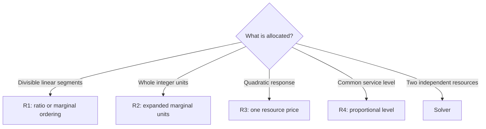

# One-Resource Allocation

These translations divide one shared resource among bounded decisions. The decision
domain determines which construction is valid.

| Rule | Domain | Objective shape | Direct idea |
|---|---|---|---|
| R1 | REAL | Linear or concave piecewise-linear benefit | Order marginal segments |
| R2 | INT | Discrete convex cost or concave benefit | Order marginal units |
| R3 | REAL | Strictly convex separable quadratic | Scan multiplier breakpoints |
| R4 | REAL | Proportional max-min fairness | Compute one common service level |



## R1 — Continuous piecewise-linear allocation

**Status:** Exact translation

### Problem

After contributions are collected by decision identity, the normalized component is

```text
maximize  sum_i g_i(x_i)
subject to lo_i <= x_i <= hi_i
           sum_i a_i*x_i <= B       or       sum_i a_i*x_i = B
```

Each `g_i` is concave piecewise linear and each `a_i` is positive. Ordinary
fractional knapsack is the one-segment case.

### DECIQL

```sql
SELECT id, amount
FROM materials
DECIDE amount(REAL)
SUCH THAT amount <= available
      AND SUM(unit_cost*amount) <= 1000
MAXIMIZE SUM(unit_value*amount);
```

### Direct SQL

For the one-segment example, the generated relation has this shape. `decision_key` is
DeciDB's internal decision identity; `exact_fill` distinguishes `=` from `<=`.

```sql
WITH params(resource_limit, exact_fill) AS (
    VALUES (1000.0, FALSE)
), normalized AS (
    SELECT decision_key, 0.0 AS lo, available AS hi,
           unit_cost AS a, unit_value AS marginal_value
    FROM bound_material_decisions
), state AS (
    SELECT p.*,
           SUM(a*lo) AS baseline_resource,
           SUM(a*(hi-lo)) AS extra_capacity,
           BOOL_AND(lo <= hi) AS boxes_valid
    FROM normalized, params p
    GROUP BY p.resource_limit, p.exact_fill
), outcome AS (
    SELECT *, resource_limit-baseline_resource AS remaining,
           boxes_valid
           AND resource_limit >= baseline_resource
           AND (NOT exact_fill
                OR resource_limit <= baseline_resource+extra_capacity) AS feasible
    FROM state
), ranked AS (
    SELECT n.*,
           a*(hi-lo) AS segment_resource,
           marginal_value/a AS density,
           COALESCE(SUM(a*(hi-lo)) OVER (
               ORDER BY marginal_value/a DESC, decision_key
               ROWS BETWEEN UNBOUNDED PRECEDING AND 1 PRECEDING
           ), 0.0) AS prior_resource
    FROM normalized n, outcome o
    WHERE o.exact_fill OR marginal_value > 0
), taken AS (
    SELECT decision_key,
           LEAST(segment_resource,
                 GREATEST(0.0, o.remaining-prior_resource)) AS used_resource
    FROM ranked, outcome o
), extras AS (
    SELECT decision_key, SUM(used_resource/a) AS extra
    FROM taken JOIN normalized USING (decision_key)
    GROUP BY decision_key
)
SELECT n.decision_key, n.lo + COALESCE(e.extra, 0.0) AS amount
FROM normalized n
LEFT JOIN extras e USING (decision_key)
CROSS JOIN outcome o
WHERE o.feasible;
```

The status branch reports DECIDE infeasibility when `feasible` is false; it does not
interpret the empty assignment relation as a successful result. A piecewise-linear
objective uses one `ranked` row per segment and orders equal-density segments by
decision identity and segment ordinal.

### Direct algorithm

1. Collapse repeated occurrences by internal decision identity, validate the normalized
   component, and shift every decision to its lower bound.
2. Let `B' = B - sum(a_i*lo_i)` and let `C` be the total remaining resource capacity.
   Report infeasibility if `B' < 0`, or if equality requires `B' > C`.
3. Represent each linear piece by its resource capacity and marginal benefit per unit
   of resource, preserving segment order within each decision.
4. For equality, rank every segment. For an upper inequality, discard all nonpositive
   marginal-benefit segments. Fill the remaining order, partially filling at most one
   segment, until `B'` is reached or no improving segment remains.
5. Sum the chosen segment lengths into each decision, validate the assignment, and map
   it back through internal decision identity.

### Why it works

**Feasibility.** Every chosen segment amount lies between zero and its capacity, so the
reconstructed decision stays in its box. Equality feasibility gives `0 <= B' <= C`;
continuity allows the final segment to be split, so the construction uses exactly
`B'`. The upper-bound construction uses at most `B'` and may stop early.

**Optimality.** Suppose an assignment uses resource in a lower-density segment while a
higher-density segment has spare capacity. Moving the same resource to the latter
strictly improves the objective, or preserves it when the densities tie. Repeating
this exchange produces the ranked prefix. Concavity makes every earlier segment of one
decision at least as dense as every later segment, so that prefix is a legal decision
value. Under equality the prefix may include negative marginals because the resource
must be used. Under an upper bound, a nonpositive marginal cannot improve the
objective, so stopping before it is optimal.

### Valid when

- After exact sign normalization, the objective is a maximization of finite, continuous,
  separable concave piecewise-linear functions over REAL decisions with finite bounds
  `lo_i <= hi_i`. Each function has an exact finite segment decomposition, including
  its lower-endpoint value, and its marginal benefits are nonincreasing.
- Each independent component has exactly one coupling constraint of the form
  `sum(a_i*x_i) <= B` or `sum(a_i*x_i) = B`, with finite strictly positive `a_i`;
  there is no second resource, other coupling, cross-decision objective term, or
  secondary objective.
- Coefficients, bounds, objective pieces, and the effective RHS are collected by the
  actual row, entity, or scalar decision identity. An entity cannot occur in multiple
  resource components, and component keys and functional dependencies are proved from
  bound metadata rather than runtime statistics.
- `WHEN` masks agree with the proved component. A NULL `PER` key bypasses the factor
  instead of forming a NULL partition. Data-valued RHSs use DECIDE's directional
  reduction, and both directions of an equality agree.
- Inconsistent boxes, `B' < 0`, and equality with `B' > C` take the DECIDE infeasible
  branch. Empty input returns zero source rows and creates no synthetic aggregate row;
  finite boxes exclude unboundedness.
- Every required value is known non-NULL and finite, or a generated guard reproduces
  DECIDE's NULL/nonfinite outcome before division, sorting, or aggregation.
- Density division, prefix sums, the partial segment, and the final resource residual
  follow DECIDE's overflow and tolerance policy. Before replacement, admission must
  prove that the constructed assignment will pass the bound, resource, and objective
  checks; otherwise the query remains on the solver path.
- Assignment rows are keyed by internal decision identity, use DECIDE's result type,
  fan out to every corresponding source row, and preserve source cardinality, schema,
  and surrounding relational behavior.

> **Not this class:** BOOL or INT decisions cannot partially fill the final segment. Two resources also destroy the single marginal ordering.

## R2 — Bounded integer marginal units

**Status:** Exact translation

### Problem

After common resource scaling and objective sign normalization, the component is

```text
minimize  sum_i g_i(x_i)
subject to lo_i <= x_i <= hi_i,  x_i integer
           sum_i x_i <= K        or        sum_i x_i = K
```

Each discrete marginal cost `g_i(q)-g_i(q-1)` is nondecreasing. Maximizing separable
concave benefit is the same construction after negating its marginal benefits.

### DECIQL

```sql
SELECT id, x
FROM allocation
DECIDE x(INT)
SUCH THAT x BETWEEN lo AND hi
      AND SUM(x) = 7
MINIMIZE SUM(POWER(x-target, 2));
```

### Direct SQL

```sql
WITH params(k, exact_fill) AS (
    VALUES (7::BIGINT, TRUE)
), normalized AS (
    SELECT decision_key,
           CEIL(lo)::BIGINT AS lo_i,
           FLOOR(hi)::BIGINT AS hi_i,
           target
    FROM bound_allocation_decisions
), state AS (
    SELECT p.*,
           SUM(lo_i)::BIGINT AS baseline,
           SUM(hi_i-lo_i)::BIGINT AS extra_capacity,
           BOOL_AND(lo_i <= hi_i) AS boxes_valid
    FROM normalized, params p
    GROUP BY p.k, p.exact_fill
), outcome AS (
    SELECT *, k-baseline AS extra_limit,
           boxes_valid AND k >= baseline
           AND (NOT exact_fill OR k <= baseline+extra_capacity) AS feasible
    FROM state
), units AS (
    SELECT decision_key, q,
           POWER(q-target, 2)
             - POWER((q-1)-target, 2) AS marginal_cost
    FROM normalized,
         LATERAL range(lo_i+1, hi_i+1) r(q)
), ranked AS (
    SELECT *, ROW_NUMBER() OVER (
        ORDER BY marginal_cost, decision_key, q
    ) AS marginal_rank
    FROM units
), chosen AS (
    SELECT r.*
    FROM ranked r, outcome o
    WHERE o.feasible
      AND marginal_rank <= LEAST(o.extra_limit, o.extra_capacity)
      AND (o.exact_fill OR marginal_cost < 0)
), counts AS (
    SELECT decision_key, COUNT(*) AS extra
    FROM chosen
    GROUP BY decision_key
)
SELECT n.decision_key, n.lo_i + COALESCE(c.extra, 0) AS x
FROM normalized n
LEFT JOIN counts c USING (decision_key)
CROSS JOIN outcome o
WHERE o.feasible;
```

The status branch reports infeasibility when `feasible` is false. Before this SQL, a
common coefficient `a` is scaled out: equality requires `B/a` to be an admissible
integer `K`, whereas an upper inequality uses the largest legal integer capacity. A
failed divisibility check is called infeasible only when DECIDE's numeric policy proves
that outcome; an ambiguous case does not match the rule.

### Direct algorithm

1. Collapse repeated occurrences by internal decision identity, derive the exact
   integer capacity `K`, and start every decision at its legal integer lower bound.
2. Let `E = K - sum(lo_i)`. Report infeasibility if a box is empty, `E < 0`, or equality
   has `E > sum(hi_i-lo_i)`.
3. Expand every legal increment `q-1 -> q` into a marginal-unit row and sort by
   marginal cost, then decision identity and `q`.
4. For equality, take exactly the `E` cheapest units. For an upper inequality, take at
   most `E` units and stop before the first nonnegative marginal cost. For maximization,
   this is equivalently taking only positive marginal benefits.
5. Count chosen units per decision, add them to its lower bound, validate the complete
   assignment, and map it back by internal decision identity.

### Why it works

**Feasibility.** Nondecreasing marginals plus the `q` tie-break place every predecessor
before a later unit of the same decision. The selected units therefore form a prefix,
so each reconstructed integer lies in its box. Equality selects exactly `E` units;
the upper-bound case selects no more than `E`.

**Optimality.** Every legal integer assignment is a collection of such prefixes, and
its objective equals the lower-bound objective plus the sum of their marginal costs.
For any fixed count `k`, no `k`-unit set can cost less than the globally cheapest `k`
marginals. That cheapest set is prefix-closed because marginals are nondecreasing and
ties order smaller `q` first, so it attains the lower bound. Equality uses `k = E`. For
an upper bound, the best count is the smaller of `E` and the number of negative
marginals: each negative unit improves the objective, while a zero or positive unit
does not. Negating marginal benefits gives the identical proof for concave
maximization.

### Valid when

- After exact sign normalization, the objective is minimization of finite separable
  discrete-convex functions over contiguous finite INT domains
  `[CEIL(lo_i), FLOOR(hi_i)]`; equivalently, a maximized benefit has nonincreasing
  discrete marginals. There are no cross-decision terms or secondary objectives.
- Each independent component has exactly one coupling constraint with identical finite
  positive coefficients after exact common scaling, yielding `sum(x_i) <= K` or
  `sum(x_i) = K`; there is no other coupling. Equality scaling includes an exact
  divisibility/integrality check, and upper-bound scaling derives `K` with DECIDE's
  integer and numeric policy.
- Coefficients, bounds, objective terms, and the effective RHS are collected by actual
  row, entity, or scalar decision identity. No identity belongs to multiple resource
  components, and component keys are proved from bound metadata rather than observed
  data.
- `WHEN` masks agree with the component. A NULL `PER` key bypasses the factor, and
  data-valued RHSs use DECIDE's directional reduction; both equality directions agree.
- Empty integer boxes, `K < sum(lo_i)`, and equality with `K > sum(hi_i)` take the
  DECIDE infeasible branch. A nonintegral equality target does so only when
  infeasibility is certified under DECIDE's numeric policy; otherwise the rule does not
  match. Empty input returns zero source rows without creating a scalar aggregate row;
  finite domains exclude unboundedness.
- Bounds, coefficients, RHS values, and marginal costs are known non-NULL and finite,
  or a generated guard reproduces DECIDE's NULL/nonfinite outcome before expansion.
  All derived bounds, counts, and sums fit DECIDE's `BIGINT` result contract.
- The exact total number of marginal rows is below the configured expansion limit.
  Marginal arithmetic and comparisons follow DECIDE's overflow and tolerance policy,
  and admission must prove before replacement that the final box, resource,
  integrality, and objective checks succeed; otherwise the rule does not match.
- Assignment rows use internal decision identity, fan out to every corresponding source
  row, and preserve DECIDE result types, source cardinality, schema, and surrounding
  relational behavior.

> **Not this class:** Unequal resource coefficients create weighted integer knapsack.
> Nonmonotone marginals can make a later unit attractive without its expensive
> predecessor.

## R3 — Strictly convex quadratic allocation

**Status:** Exact prototype

### Problem

After contributions are collected by decision identity, the normalized component is

```text
minimize  sum_i (0.5*d_i*x_i^2 - y_i*x_i)
subject to lo_i <= x_i <= hi_i
           L <= sum_i a_i*x_i <= U
```

Each curvature `d_i` and resource coefficient `a_i` is positive. A one-sided resource
bound or equality is an interval with one missing side or with `L = U`.

### DECIQL

```sql
SELECT id, amount
FROM items
DECIDE amount(REAL)
SUCH THAT amount <= 30
      AND SUM(amount) <= budget
MINIMIZE SUM(POWER(amount-target, 2));
```

### Direct SQL

For a selected active resource boundary `T`, every decision is a clamp:

```sql
SELECT decision_key,
       LEAST(
           hi,
           GREATEST(lo, (y-lambda*a)/d)
       ) AS amount
FROM normalized_items
CROSS JOIN chosen_multiplier;
```

`normalized_resource_bounds` replaces a missing lower or upper resource bound by the
reachable endpoint `R_min` or `R_max`. Let
`r(lambda) = sum(a_i*x_i(lambda))`. At `lambda` below every breakpoint,
`r(lambda) = sum(a_i*hi_i)`. The multiplier is found by grouping equal breakpoints
before applying their combined change to that affine function:

```sql
WITH resource_state AS (
    SELECT SUM(a*hi) AS upper_resource,
           SUM(a*lo) AS lower_resource,
           SUM(a*LEAST(hi, GREATEST(lo, y/d))) AS independent_resource
    FROM normalized_items
), active_boundary AS (
    SELECT CASE
             WHEN independent_resource > U THEN U
             WHEN independent_resource < L THEN L
           END AS T
    FROM resource_state CROSS JOIN normalized_resource_bounds
), events AS (
    SELECT decision_key, (y-d*hi)/a AS breakpoint,
           a*y/d-a*hi AS delta_c,
           -a*a/d AS delta_s
    FROM normalized_items
    UNION ALL
    SELECT decision_key, (y-d*lo)/a,
           a*lo-a*y/d,
           a*a/d
    FROM normalized_items
), grouped AS (
    SELECT breakpoint, SUM(delta_c) AS delta_c, SUM(delta_s) AS delta_s
    FROM events
    GROUP BY breakpoint
), intervals AS (
    SELECT breakpoint AS interval_lo,
           LEAD(breakpoint) OVER (ORDER BY breakpoint) AS interval_hi,
           upper_resource
             + SUM(delta_c) OVER (ORDER BY breakpoint) AS c,
           SUM(delta_s) OVER (ORDER BY breakpoint) AS s
    FROM grouped CROSS JOIN resource_state
), affine_candidates AS (
    SELECT (T-c)/s AS lambda, interval_lo, interval_hi
    FROM intervals CROSS JOIN active_boundary
    WHERE s < 0
), flat_candidates AS (
    SELECT interval_lo AS lambda, interval_lo, interval_hi
    FROM intervals CROSS JOIN active_boundary
    WHERE s = 0 AND c = T
), candidates AS (
    SELECT * FROM affine_candidates
    UNION ALL
    SELECT * FROM flat_candidates
)
SELECT lambda
FROM candidates
WHERE lambda >= interval_lo
  AND (interval_hi IS NULL OR lambda <= interval_hi)
ORDER BY interval_lo
LIMIT 1;
```

Call that one-row scan result `active_multiplier`. It exists only for a finite active
boundary. After the feasibility gate in step 1, the complete assignment relation
dispatches the other branches explicitly:

```sql
WITH branch AS (
    SELECT CASE
             WHEN independent_resource BETWEEN L AND U THEN 'INACTIVE'
             WHEN T = upper_resource THEN 'ALL_UPPER'
             WHEN T = lower_resource THEN 'ALL_LOWER'
             ELSE 'ACTIVE_INTERIOR'
           END AS kind
    FROM resource_state
    CROSS JOIN normalized_resource_bounds
    CROSS JOIN active_boundary
), assignments AS (
    SELECT decision_key, LEAST(hi, GREATEST(lo, y/d)) AS amount
    FROM normalized_items CROSS JOIN branch
    WHERE kind = 'INACTIVE'
    UNION ALL
    SELECT decision_key, hi FROM normalized_items CROSS JOIN branch
    WHERE kind = 'ALL_UPPER'
    UNION ALL
    SELECT decision_key, lo FROM normalized_items CROSS JOIN branch
    WHERE kind = 'ALL_LOWER'
    UNION ALL
    SELECT decision_key, LEAST(hi, GREATEST(lo, (y-lambda*a)/d))
    FROM normalized_items CROSS JOIN branch CROSS JOIN active_multiplier
    WHERE kind = 'ACTIVE_INTERIOR'
)
SELECT decision_key, amount FROM assignments;
```

Thus the two infinite tails require no infinite SQL value. A candidate exactly on a
breakpoint produces the same clamped assignment from either adjacent interval.

### Direct algorithm

1. Collapse repeated occurrences by internal decision identity, validate every box, and
   compute the reachable resource range
   `[R_min, R_max] = [sum(a_i*lo_i), sum(a_i*hi_i)]`. Report infeasibility if it does
   not intersect the required resource interval.
2. Compute the independent box minimizer `x_i(0) = clamp(y_i/d_i, lo_i, hi_i)`. Return
   it if its resource use is in `[L,U]`; otherwise choose `T = U` when it is above the
   interval and `T = L` when it is below.
3. Generate the entry breakpoint `(y_i-d_i*hi_i)/a_i` and exit breakpoint
   `(y_i-d_i*lo_i)/a_i` for every decision. Group equal breakpoints and apply all of
   their affine intercept and slope changes atomically.
4. Scan the resulting intervals. In an interval with `r(lambda) = c+s*lambda` and
   `s < 0`, test `lambda = (T-c)/s`. If `s = 0` and `c = T`, choose either endpoint
   of that constant interval. Handle `T = R_max` or `T = R_min` directly at the
   corresponding all-bound assignment.
5. Broadcast the chosen multiplier, clamp every decision, recompute resource use and
   the optimality residuals, and map the certified assignment back by internal identity.

### Why it works

**Feasibility.** Positive resource coefficients and continuous boxes make the reachable
resource values exactly `[R_min,R_max]`. The initial range test therefore detects every
resource infeasibility. If the independent minimizer violates one side, continuity of
`r(lambda)` guarantees a multiplier whose clamped assignment reaches the selected
boundary `T`; the breakpoint scan covers every affine piece and hence finds it. The
clamps satisfy all boxes and reaching `T` satisfies the resource interval.

**Optimality.** For fixed `lambda`, minimizing
`0.5*d_i*x_i^2-y_i*x_i+lambda*a_i*x_i` over a box gives
`x_i(lambda) = clamp((y_i-lambda*a_i)/d_i, lo_i, hi_i)`. If the upper resource bound
is active then `lambda >= 0`; if the lower bound is active then `lambda <= 0`; and an
inactive interval uses `lambda = 0`. These assignments satisfy stationarity, bound
normal-cone conditions, resource feasibility, and complementary slackness. Those KKT
conditions are sufficient for this convex problem, and strict convexity makes the
primal assignment unique. Grouping coincident events applies all changes at the same
point, and the explicit constant-interval case handles a nonunique multiplier, so the
scan cannot skip the balancing assignment.

### Valid when

- After exact sign normalization, the objective is minimization of a finite separable
  diagonal quadratic over REAL decisions, with finite boxes `lo_i <= hi_i` and strictly
  positive curvature `d_i`; there are no cross terms, linear couplings outside the
  displayed resource expression, or secondary objectives.
- Each independent component has exactly one resource lower bound, upper bound,
  equality, or interval with finite strictly positive coefficients `a_i`; every other
  constraint is an individual box, and each finite pair of resource bounds satisfies
  `L <= U`.
- Quadratic, resource, and bound coefficients are collected by actual row, entity, or
  scalar decision identity. No identity belongs to multiple resource components, and
  component keys and functional dependencies are proved from bound metadata rather
  than runtime statistics.
- `WHEN` masks agree with the component. A NULL `PER` key bypasses the factor, and
  data-valued RHSs use DECIDE's directional reduction; both directions of an equality
  agree.
- Empty boxes, `L > U`, or an empty intersection between `[L,U]` and
  `[R_min,R_max]` take the DECIDE infeasible branch. Empty input returns zero source
  rows and creates no synthetic aggregate row; finite boxes and positive curvature
  exclude unboundedness.
- All bounds, coefficients, and RHS values are known non-NULL and finite, or a generated
  guard reproduces DECIDE's NULL/nonfinite outcome before division or sorting.
- Breakpoint arithmetic and ordering have a pre-rewrite proof of correctness under
  DECIDE's numeric policy; values equal under that policy are grouped before prefix
  updates, and endpoint targets are explicit. A residual is resolved only by
  recomputing `lambda` on the same affine interval and then all free decisions—not by
  patching one decision independently.
- Overflow-safe sums and a proved error bound guarantee before replacement that the
  result meets DECIDE's tolerances for boxes, the active resource boundary,
  stationarity, multiplier sign, and complementary slackness. If breakpoint ordering
  or those checks cannot be guaranteed, the rule is not admitted.
- Assignment rows use internal decision identity and DECIDE's REAL result type, fan out
  to every corresponding source row, and preserve source cardinality, schema, and
  surrounding relational behavior.

> **Not this class:** A cross term `x_i*x_j`, a second resource, nonpositive curvature, or INT decisions invalidates the one-price construction.

## R4 — Proportional max-min fairness

**Status:** Exact translation

### Problem

Allocate one resource to maximize the worst normalized service level.

```text
maximize  min(x_i / demand_i)
subject to 0 <= x_i <= cap_i
           sum(resource_cost_i * x_i) <= budget
```

### DECIQL

```sql
SELECT id, x
FROM demands
DECIDE x(REAL)
SUCH THAT x <= cap
      AND SUM(resource_cost*x) <= 12
MAXIMIZE MIN(x/demand);
```

### Direct SQL

```sql
WITH params(budget) AS (
    VALUES (12.0)
), normalized AS (
    SELECT decision_key, demand, cap, resource_cost
    FROM bound_demand_decisions
), state AS (
    SELECT COUNT(*) AS decision_count,
           SUM(resource_cost*demand) AS resource_per_level,
           MIN(cap/demand) AS cap_level,
           MIN(cap) >= 0 AND p.budget >= 0 AS feasible,
           p.budget
    FROM normalized, params p
    GROUP BY p.budget
), level AS (
    SELECT LEAST(budget/resource_per_level, cap_level) AS t
    FROM state
    WHERE feasible AND decision_count > 0
), assignments AS (
    SELECT decision_key, demand*t AS x
    FROM normalized CROSS JOIN level
)
SELECT decision_key, x
FROM assignments;
```

The status branch reports infeasibility for a negative budget or inconsistent cap. The
empty-input branch returns zero source rows without evaluating the scalar level.

### Direct algorithm

1. Collapse repeated occurrences by internal decision identity, validate the normalized
   parameters, and report infeasibility for a negative budget or inconsistent box.
2. For nonempty input, compute
   `t = min(B/sum(a_i*d_i), min_i(cap_i/d_i))`.
3. Assign `x_i = d_i*t`, certify resource and cap feasibility, and map the assignment
   back through internal decision identity. Preserve an empty source as empty.

### Why it works

**Feasibility.** Nonnegative `B` and caps make the computed `t` nonnegative. Its cap
term gives `d_i*t <= cap_i` for every decision, and its resource term gives
`sum(a_i*d_i*t) <= B`; hence `x_i = d_i*t` is feasible and has minimum normalized
service exactly `t`.

**Optimality.** Any assignment whose minimum normalized service is `s` must satisfy
`x_i >= d_i*s` for every decision. It therefore needs at least
`s*sum(a_i*d_i)` resource and also requires `s <= cap_i/d_i` for every `i`. Thus `s`
cannot exceed either term in the displayed minimum. The constructed assignment reaches
that common upper bound, so it is optimal. Leftover resource cannot improve the minimum
after a cap fixes the level and is irrelevant because there is no secondary objective.

### Valid when

- The objective is exactly maximization of one minimum normalized service ratio over
  REAL decisions: `maximize min_i(x_i/d_i)`. Each finite `d_i` is strictly positive;
  there are no additional objective terms or secondary objective.
- Every decision has exactly the box `0 <= x_i <= cap_i`, with finite `cap_i >= 0`,
  and the component has exactly one coupling constraint
  `sum(a_i*x_i) <= B`, with finite strictly positive `a_i` and finite `B`. There is no
  lower resource requirement, equality, second resource, or other coupling.
- Repeated source occurrences are collapsed by actual row, entity, or scalar decision
  identity before the formula is applied: resource coefficients are summed, the
  tightest cap is retained, and the greatest positive demand denominator is used. No
  identity belongs to multiple fairness components, and component keys are proved from
  bound metadata rather than runtime statistics.
- `WHEN` masks agree across the objective, box, and resource factor. A NULL `PER` key
  bypasses its factor, and the data-valued upper RHS is reduced with DECIDE's `MIN`
  rule.
- `B < 0` or an inconsistent box takes the DECIDE infeasible branch. `B = 0` and zero
  caps are valid and produce level zero. Empty input returns zero source rows and does
  not manufacture a scalar level; finite caps exclude unboundedness.
- Demand, cap, resource coefficient, and RHS values are known non-NULL and finite, or a
  generated guard reproduces DECIDE's NULL/nonfinite outcome before aggregation or
  division.
- Products, sums, division, and reconstructed assignments follow DECIDE's overflow and
  tolerance policy. A directed-rounding or error-bound proof must establish before
  replacement the greatest representable feasible `t`, cap/resource feasibility, and
  the attained minimum ratio; otherwise the rule is not admitted.
- Assignment rows use internal decision identity and DECIDE's REAL result type, fan out
  to every corresponding source row, and preserve source cardinality, schema, and
  surrounding relational behavior.

> **Not this class:** Adding a secondary value-maximization objective changes how
> leftover budget should be allocated. Multiple resources or nonzero baselines require
> a different water-level rule.

## Why the domain matters

The same surface description—"allocate a budget"—can denote different optimization
problems:

- **REAL:** one segment may be partially filled, enabling R1.
- **INT:** only complete marginal units may be chosen, enabling R2 under discrete
  convexity.
- **BOOL:** each item is indivisible and normally belongs to a selection rule.
- **Quadratic REAL:** allocation responds continuously to one shared multiplier, as in
  R3.

A shared implementation primitive does not make these domains interchangeable.
