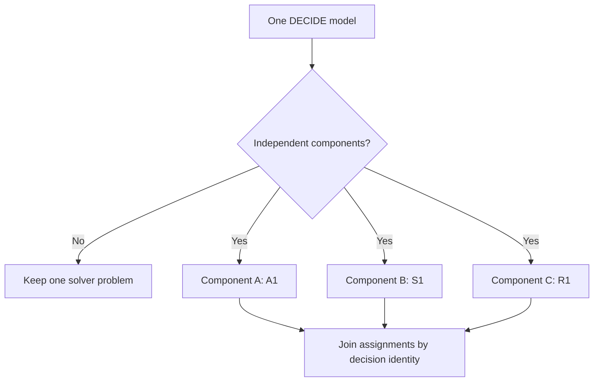

# Composition and Boundaries

The catalogue is more useful as a small algebra than as a collection of unrelated
patterns. A larger DECIDE model may simplify after fixed decisions are substituted, or
split into independent components that use different leaf translations.

This file also marks the boundary between exact translations, research candidates, and
problem shapes that should stay with the solver.

## D1 — Exact keyed decomposition

**Status:** Exact translation

### Problem

After fixed decisions are substituted, the feasible set separates into independent
components:

```text
F = F1 x F2 x ... x Fm
```

D1 is a meta-rule. It does not solve a component itself; it proves the split, applies a
supported leaf translation to every component, and joins their assignments.

### DECIQL

```sql
SELECT id, department, selected
FROM candidates
DECIDE selected(BOOL)
SUCH THAT SUM(selected) = 1 PER department
MAXIMIZE SUM(score*selected);
```

Each department is an independent S1 component.

### Direct SQL

```sql
WITH ranked AS (
    SELECT _decision_id, score,
           ROW_NUMBER() OVER (
               PARTITION BY department
               ORDER BY score DESC, _decision_id
           ) AS rank
    FROM decision_rows
    WHERE _in_department_factor
), assignments AS (
    SELECT _decision_id, (rank = 1)::INTEGER AS selected
    FROM ranked
    UNION ALL
    SELECT _decision_id, (score > 0)::INTEGER AS selected
    FROM decision_rows
    WHERE NOT _in_department_factor
)
SELECT s.id, s.department, a.selected
FROM source_rows s
JOIN assignments a USING (_decision_id);
```

`_in_department_factor` is false for a NULL `PER` key, so those decisions bypass the
equality and are optimized independently. The same identity-based assembly works when
different component types use different leaf rules.

### Direct algorithm

1. Substitute decisions already fixed by bounds or an exact rule such as A5.
2. Build the remaining decision-interaction structure.
3. Prove that each factor belongs wholly to one component.
4. Match every component to a supported leaf translation.
5. Solve components by their partition keys and join typed assignments back.



### Why it works

- **Feasibility.** If every normalized factor belongs to one component, the global
  feasible set is the Cartesian product of the component feasible sets. One feasible
  assignment from every component therefore forms a feasible global assignment, and a
  single infeasible component makes the global problem infeasible.
- **Optimality.** For an additive objective, replacing any component assignment by its
  local optimum cannot worsen the global sum. Applying that replacement component by
  component proves that their joined assignment is globally optimal. The same argument
  applies to an outer `MIN` or `MAX` only when its required monotone direction is proved
  for every component value and each local optimum is attained.
- **Mapping.** Disjoint internal decision identities make the component assignment
  relations disjoint. Their union followed by one identity join therefore assigns every
  decision exactly once and repeats entity or scalar values on precisely their original
  output rows.

### Valid when

- After all proved fixed decisions are substituted, every normalized constraint and
  every nonseparable objective term lies wholly in one component. The only admitted
  cross-component objective is an additive combination or an explicitly
  coordinatewise-monotone outer `MIN`/`MAX` in one proved direction.
- For an outer `MIN`/`MAX`, every component has a finite, attained optimum in the
  required direction. For an additive objective, an infeasible component takes
  precedence; otherwise a component unbounded in the favorable direction makes the
  query unbounded, and only finite attained component optima are assembled as rows.
- Exact row, entity, and scalar decision identities are known. No identity occurs in two
  components, and the complete entity tuple—not a coincidental data value—determines
  any component key.
- `PER` keys, `WHEN` masks, relation-qualified reducers, join multiplicities, and
  data-valued right-hand sides are normalized before decomposition. NULL-key bypass,
  shared scalars, or any crossing factor reconnects the affected decisions instead of
  being split.
- Every component matches one complete leaf rule and satisfies that leaf's full
  `Valid when` list. A proof miss in any component is an atomic miss for the whole
  query and leaves the original DECIDE node on the solver path.
- Component keys and solver-read coefficients are non-NULL and finite wherever DECIDE
  requires them. Empty components and the admitted infeasible or unbounded cases follow
  the outcome precedence above and are never treated as missing join rows.
- Each leaf returns a typed assignment keyed by stable internal identity. Assembly
  verifies exactly one value per decision and preserves source-row cardinality, scalar
  and entity fan-out, projection, ordering, and DECIDE numeric/error behavior.

> **Not this class:** If one entity appears in two `PER` groups, solving the groups independently can assign contradictory values to the shared entity decision.

## Safe composition order

Use the rules in this conceptual order:

1. **Normalize identity and coefficients.** Collapse repeated references to the same
   row, entity, or scalar decision.
2. **Fix forced decisions.** Apply point bounds and monotone A5 directions.
3. **Recompute components.** Fixing variables may disconnect the model.
4. **Choose the narrowest leaf rule.** Prefer a projection or aggregate over a sort,
   and a sort over finite expansion when both are exact.
5. **Assemble once.** Join each typed decision relation back through its internal
   identity.

Examples of safe relationships:

- A1 is the inactive-resource branch of R3.
- S1 is the width-one Boolean analogue of R2, but keeps a distinct proof.
- R1 and R2 share marginal ordering, but only R1 permits a partial final segment.
- O1 distance minimization is the unit-mass special case of O2.
- D1 can run S1, R1, or another leaf independently per proven partition.

## Research candidates

These shapes have a useful theorem or plausible relational construction, but at least
one proof, admission, numeric, or performance condition remains open.

| ID | Problem shape | Candidate construction | Main open issue |
|---|---|---|---|
| P1 | Small finite-domain separator | Enumerate separator assignments, solve residual leaves, rank scenarios | Static size and component proof |
| P2 | Boolean prefix or chain choice | Score every prefix and select the best cut | Exact chain recognition and edge semantics |
| P3 | One contiguous selected segment | Prefix minima or sliding windows | Complete constraint recognition |
| P4 | Unique-path or tree transshipment | Prefix or subtree balance | Proving the exact topology |
| P5 | L2 isotonic regression | Pool-adjacent-violators or interval-average construction | Natural DuckDB execution |
| P6a | Maximum-cardinality interval scheduling | Earliest-finish recursion | Recursive-plan performance |
| P6b | Minimum interval stabbing | Right-endpoint recursion | Recursive-plan performance |
| P6c | Minimum interval covering | Farthest-reach recursion | Recursive-plan performance |
| P7 | Horn least-model propagation | Recursive forward chaining | Closure execution and admission |
| P8 | Tolerance-separated L0 projection | Rank loss improvements | Optimizer-visible tolerance proof |
| P9 | Capped minimax load | Breakpoint water filling | Total plan and numeric policy |
| P10 | Fixed-dimensional bounded least squares | Aggregate Gram matrix and enumerate active sets | Dimension and conditioning limits |
| P11 | Quadratic plus L1 resource allocation | Expanded multiplier-event scan | Breakpoint completeness and numerics |
| P12 | Signed bounded L1 projection | Lower/upper threshold events | Complete threshold and residual policy |
| P13 | Fairness with baselines or asymmetric penalties | Generalized water-level scan | Exact template and outcome handling |

These are research directions, not additional supported translations.

## Keep the solver

| Problem shape | Why no direct relational translation is proposed |
|---|---|
| Strictly layered DAG best path | Exact recursive SQL prototype was slower than the solver |
| General 2-SAT | Strongly connected component computation is unnatural in the current relational path |
| General matching, assignment, transport, or flow | Requires residual graph or augmenting-path state |
| Arbitrary Boolean or bounded knapsack | No ranking constructs the optimum in general |
| Set cover, packing, and facility location | Requires combinatorial subset search |
| Crossing quotas | Independent rankings interfere with one another |
| General graph algorithms | Require mutable relaxation, union, or cut state |
| Totally unimodular matrices in general | Integrality alone does not construct an assignment |
| General coupled QP or QCQP | No finite candidate set or one-multiplier construction |
| Generic bounded-treewidth dynamic programs | Relational state grows exponentially with width or domain |
| Runtime-only structure | Current data looking unique, balanced, laminar, or Monge is not a proof |

## Hard rejection checklist

Keep the solver unless a rule can answer all of the following:

- What exact normalized problem shape is recognized?
- Which query or catalog facts prove every required condition?
- How does relational SQL construct **every** decision value?
- Why is that assignment feasible and optimal?
- What happens for invalid, empty, infeasible, unbounded, and tied cases?
- What nearby problem would make the construction wrong?

Polynomial-time solvability alone is not enough. The algorithm must have a natural,
complete construction using existing relational operators, and the optimizer must be
able to prove its preconditions before execution.

## Current frontier

The research supports beginning with narrow, easy-to-explain classes:

1. A1 and A5 for independent or monotone decisions.
2. S1 for flat and partitioned cardinality selection.
3. R1 for divisible linear allocation.
4. R3 for quadratic one-resource allocation once its numeric proof obligations can be
   enforced by the optimizer.
5. S4 for the narrow Q9-style extremum objective.

The remaining exact classes broaden the same projection, aggregate, rank, threshold,
and prefix mechanisms. The research candidates should remain visible without being
mistaken for implementation commitments.
