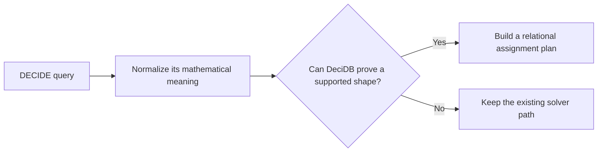

# Direct Solve

Direct solve is a proposed DECIDE optimization path. When DeciDB can prove that a
problem has a supported mathematical shape, it can construct an optimal assignment
with ordinary DuckDB relational operators instead of building and invoking a general
solver model.

This directory describes the researched translations. The optimizer does **not** yet
select these rewrites in production.

## Start here

| Goal | Reading path |
|---|---|
| Understand the idea | [Overview](01_overview.md) |
| See every proposed translation | This page, then the linked family documents |
| Find the boundary of the work | [Composition and boundaries](06_composition_and_boundaries.md) |
| Audit the evidence | [Research notes](07_research_notes.md) |

## Status vocabulary

| Status | Meaning |
|---|---|
| **Exact translation** | Under its complete `Valid when` contract, feasibility and optimality are proved |
| **Exact prototype** | The proof is exact, but an admission, numeric, or performance gate is not yet implementable |
| **Research candidate** | A useful theorem or algorithm exists, but the full translation contract is incomplete |
| **Solver only** | No suitable relational translation is currently proposed |

"Exact" means that the relational plan returns a feasible assignment with the same
optimal primary objective. It does not require the same tied decision vector as Gurobi
or HiGHS. Every rule's **Valid when** section is its complete admission contract. The
SQL block shows the central relational construction; it is exact only together with
the guards, identity mapping, and outcome branches listed there.

## Translation map

| Family | Problem shape | Direct construction | Rules |
|---|---|---|---|
| Formula-based | Independent decisions or fixed-small components | Projection, endpoints, or finite candidates | A1, A3, A5 |
| Shared value or geometry | Many rows summarized by one value, expression, or norm | Aggregates, scaling, thresholds, or prefix fill | A2, A4, A6, N1, N2 |
| Boolean selection | Structured yes/no choices | Rank, TopN, or cost prefixes | S1--S4 |
| One resource | Bounded allocation from one shared pool | Marginal ordering or water filling | R1--R4 |
| Ordered matching | Two complete ordered sides | Rank matching or cumulative overlap | O1, O2 |
| Decomposition | Independent components of any supported shape | Solve components and join assignments | D1 |

## Catalogue

### Formula-based translations

See [Formula-based translations](02_formula_based_translations.md).

| ID | Problem | Status |
|---|---|---|
| A1 | Independent bounded linear or quadratic decision | Exact translation |
| A2 | Shared mean, median, midpoint, or mode | Exact translation |
| A3 | Fixed-small multi-affine box | Exact translation |
| A4 | Bounded two-parameter least squares | Exact prototype |
| A5 | Objective-aligned monotone corner | Exact translation |
| A6 | One squared affine residual over a box | Exact translation |
| N1 | Projection onto or support over L1/L2/Linf balls | Exact translation |
| N2 | Linear support over a diagonal ellipsoid | Exact translation |

### Boolean selection

See [Selection translations](03_selection_translations.md).

| ID | Problem | Status |
|---|---|---|
| S1 | Top-k and cardinality intervals | Exact translation |
| S2 | Nested upper quotas | Exact translation |
| S3 | Maximum item count under one budget | Exact translation |
| S4 | Exact count and budget, maximizing the best selected item | Exact translation |

### Resource allocation

See [Resource allocation](04_resource_allocation.md).

| ID | Problem | Status |
|---|---|---|
| R1 | Continuous piecewise-linear allocation | Exact translation |
| R2 | Bounded integer marginal-unit allocation | Exact translation |
| R3 | Strictly convex quadratic allocation | Exact prototype |
| R4 | Proportional max-min fairness | Exact translation |

### Ordered matching and transport

See [Ordered matching and transport](05_ordered_matching_and_transport.md).

| ID | Problem | Status |
|---|---|---|
| O1 | Ordered complete assignment | Exact prototype |
| O2 | Balanced one-dimensional Monge transport | Exact prototype |

### Decomposition

See [Composition and boundaries](06_composition_and_boundaries.md).

| ID | Problem | Status |
|---|---|---|
| D1 | Exact keyed decomposition into supported components | Exact translation |

## Documents

- [Overview](01_overview.md) introduces the feature through three representative
  translations and explains what must be true before any rewrite is valid.
- [Formula-based translations](02_formula_based_translations.md) covers A1--A6 and
  N1--N2.
- [Selection translations](03_selection_translations.md) covers S1--S4.
- [Resource allocation](04_resource_allocation.md) covers R1--R4.
- [Ordered matching and transport](05_ordered_matching_and_transport.md) covers O1--O2.
- [Composition and boundaries](06_composition_and_boundaries.md) covers D1, safe
  composition, research candidates, and solver-only cases.
- [Research notes](07_research_notes.md) preserves correctness, evidence, references,
  and future implementation considerations without placing them in the main reading
  path.
